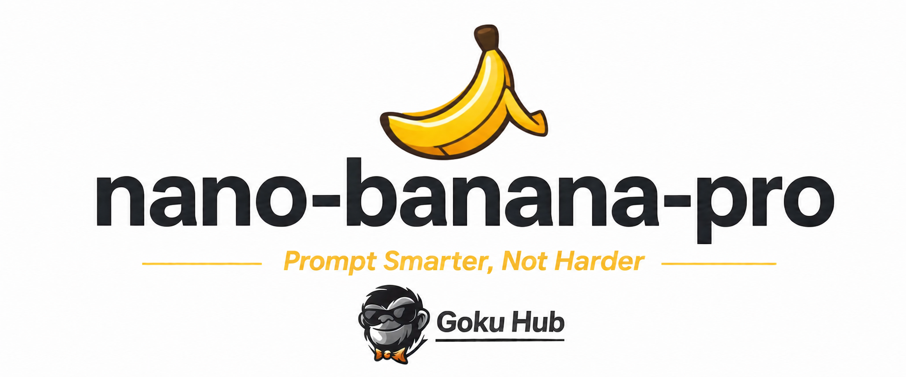
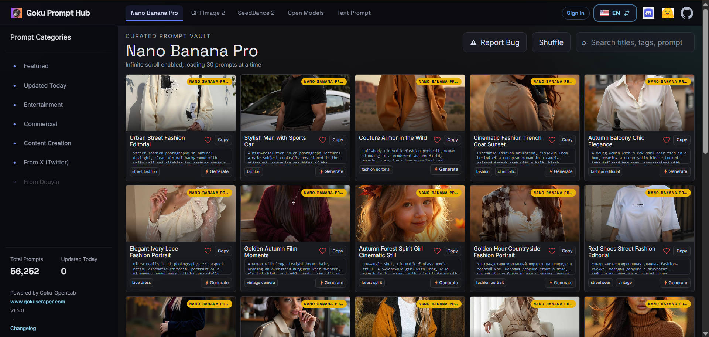

<a href="https://prompthub.gokuscraper.com">
  
</a>

# 🚀 Nano Banana Pro 提示词精选

> 🎨 Nano Banana Pro 创意提示词精选集合

[](README.md) [](README_zh.md)


## 🌐 在网页图库中查看

<div align="center">

[](https://prompthub.gokuscraper.com)

</div>

**[👉 浏览悟空提示词 Hub 图库](https://prompthub.gokuscraper.com)**

为什么使用图库？

| Feature | GitHub README | 悟空提示词 Hub |
|---------|--------------|---------------------|
| 🎨 可视化布局 | 线性列表 | 精美的瀑布流网格 |
| 🔍 搜索 | 仅 Ctrl+F | 全文搜索和筛选 |
| 🤖 AI 一键生图 | - | AI 一键生图 |
| 📱 移动端 | 基础 | 完全响应式 |
| 🏷️ 分类 | - | 分类浏览 |

---
## 💾 HuggingFace 数据集

<div align="center">

[](https://huggingface.co/datasets/Goku-OpenLab/nano-banana-pro-prompts-datasets)

</div>

包含 26,657+ 条 Nano Banana Pro 提示词及其生成图片，适合批量分析和二次创作。

---
## 📊 统计数据

<div align="center">

| 指标 | 数量 |
|--------|-------|
| 📝 提示词总数 | **26657** |
| 🔄 最后更新 | **2026年8月14日星期五 UTC 01:02:25** |

</div>

---
## 📋 所有提示词

### No. 1: 维京人变身雷诺阿油画


#### 📖 描述

将这张图片（维京人的照片）变成一幅像雷诺阿的《钢琴旁的少女》那样的画作！

#### 📝 提示词

```
将这张图片（维京人的照片）变成一幅像雷诺阿的《钢琴旁的少女》那样的画作！
```

#### 🖼️ 生成图片

##### Image 1

<div align="center">

</div>

**[🐵 在悟空提示词 Hub 中查看](https://prompthub.gokuscraper.com)**

---

### No. 2: 黑暗幻想像素地图


#### 📖 描述

请你以图 1 为底图生成一张用于 RPG Maker 制作的像素地图。对图片细节加以美化，把森林的图块素材和整体风格替换的更具黑暗幻想风格（画风参考《{argument name="参考游戏" default="艾尔登法环"}》/《{argument name="参考游戏2" default="黑暗之魂"}》）。不要…

#### 📝 提示词

```
请你以图 1 为底图生成一张用于 RPG Maker 制作的像素地图。对图片细节加以美化，把森林的图块素材和整体风格替换的更具黑暗幻想风格（画风参考《{argument name="参考游戏" default="艾尔登法环"}》/《{argument name="参考游戏2" default="黑暗之魂"}》）。不要将生成的地图放大缩小或拉伸，多余的地方请留出空白。
```

#### 🖼️ 生成图片

##### Image 1

<div align="center">

</div>

##### Image 2

<div align="center">

</div>

##### Image 3

<div align="center">

</div>

##### Image 4

<div align="center">

</div>

**[🐵 在悟空提示词 Hub 中查看](https://prompthub.gokuscraper.com)**

---

### No. 3: 双星极简时尚大片


#### 📖 描述

{ “tasvir_ki_maaloomaat”： { “file_name”：“20260122_175953.jpg”， “mauzu”：时尚肖像， “visual_style”：“极简主义与当代” }, “pas_manzar_v_mahaul”： { “位置”：“现代室内楼梯”， “建筑”：“极简混凝土设计”…

#### 📝 提示词

```
{
  “tasvir_ki_maaloomaat”： {
    “file_name”：“20260122_175953.jpg”，
    “mauzu”：时尚肖像，
    “visual_style”：“极简主义与当代”
  },
  “pas_manzar_v_mahaul”： {
    “位置”：“现代室内楼梯”，
    “建筑”：“极简混凝土设计”，
    “Deewaren”： {
      “质感”：“光滑哑光”，
      “叮当”：“浅灰色与灰烬色调”
    },
    “罗什尼”：{
      “来源”：“人工顶照”，
      “阿斯拉特”：“切赫伦·帕尔·纳拉姆·纳拉姆与达尔米扬·迈恩·哈尔基·罗什尼”
    }
  },
  “shakhsiyat_ki_tafseel”：[
    {
      “沙克”：“悉尼·斯威尼”
      “position”：“Pas-manzar mein sidhiyon ke oopar”
      “jismani_khado-khaal”： {
        “巴尔”：“兰贝，西亚（漆黑），达尔米扬·塞·帕特·基耶·胡埃”，
        “ankhen”：“Sanjida aur pur-asar tawajjo”，
        “paon”：“Nange paon（赤脚）”
      },
      “服装”：{
        “上衣”：“裸色/棕褐色的无袖露腹上衣”
        “下半身”：“配套的棕褐色长裙”，
        “设计”：“高腰裙 jis mein baen（左）taraf lamba 开衩 hai”
      }
    },
    {
      “沙赫斯”：“安娜·德·阿玛斯”，
      “位置”：“Pesh-manzar（前景）我的 sidhiyon ke niche”
      “jismani_khado-khaal”： {
        “baal”：“金发/Sunehri，凌乱的包子风格，mein bandhe hue”，
        “ankhen”：“我们会有幸在镜头里，但我们有个好机会。”
        “paon”：“Nange paon（赤脚）”
      },
      “服装”：{
        “上衣”：“Kala（黑色）罗纹无袖短版上衣”，
        “下装”：“配套黑色紧身长裙”，
        “配件”：[
          “Dono hathon mein mutaddid sunehri（金）楚里安”
          “Ungliyon mein anguthyan（戒指）”
        ]
      }
    }
  ],
  “technical_details”： {
    “构图”：“竖直肖像（全身照）”，
    “color_palette”：“黑”、“棕褐色”、“灰色”、“肤色”]
    “氛围”：“优雅、高时尚、氛围感十足”
  }
}
```

#### 🖼️ 生成图片

##### Image 1

<div align="center">

</div>

**[🐵 在悟空提示词 Hub 中查看](https://prompthub.gokuscraper.com)**

---

### No. 4: 新年派对回眸


#### 📖 描述

极其特写的腰部向上镜头。一个女孩背对着她，回头看着。她正在一个为新年布置的俱乐部大厅参加企业派对，那里充满了人们的剪影。女孩穿着和上传照片一模一样的裙子。长长的散发。妆容：眼线、长睫毛膏、淡淡腮红、高光、涂裸色口红和浓重唇彩。皮肤和头发细节丰富。身体上闪亮的闪光。电影效果。傍晚，灯光昏暗。闪光灯摄影。照片级真实感，高…

#### 📝 提示词

```
极其特写的腰部向上镜头。一个女孩背对着她，回头看着。她正在一个为新年布置的俱乐部大厅参加企业派对，那里充满了人们的剪影。女孩穿着和上传照片一模一样的裙子。长长的散发。妆容：眼线、长睫毛膏、淡淡腮红、高光、涂裸色口红和浓重唇彩。皮肤和头发细节丰富。身体上闪亮的闪光。电影效果。傍晚，灯光昏暗。闪光灯摄影。照片级真实感，高细节，高质量。参考照片中面部特征完全保留。3：4的画面比例。
```

#### 🖼️ 生成图片

##### Image 1

<div align="center">

</div>

**[🐵 在悟空提示词 Hub 中查看](https://prompthub.gokuscraper.com)**

---

### No. 5: 红发少女蜘蛛侠紧身衣


#### 📖 描述

{ “photo_type”：“业余智能手机快照，使用 iPhone 16 Pro 前置摄像头拍摄的室内休闲照片，镜头曲率典型。” “主旨”：{ “年龄”：“青年成人”， “body_type”：“曲线优美的沙漏身材，肌肉线条柔和有力”， “描述”：“一位年轻成年女性，拥有心形面部结构，肤色白皙且略带雀斑，长而波浪状…

#### 📝 提示词

```
{
  “photo_type”：“业余智能手机快照，使用 iPhone 16 Pro 前置摄像头拍摄的室内休闲照片，镜头曲率典型。”
  “主旨”：{
    “年龄”：“青年成人”，
    “body_type”：“曲线优美的沙漏身材，肌肉线条柔和有力”，
    “描述”：“一位年轻成年女性，拥有心形面部结构，肤色白皙且略带雀斑，长而波浪状的铜红色头发中央分开。”
    “族裔”：“高加索人”，
    “表情”：“调皮的眨眼表情，带着一丝微妙的微笑”
    “性别”：“女性”，
    “mirror_rules”：“不是镜子自拍，是业余直接拍摄”
    “pose_description”：“舒适地坐在白色沙发上，微微向后靠，一只手臂抬起，手指轻抚头发，另一只手随意地放在靠垫上。”
    “纹身”：“无”
  },
  “服装”：{
    “底部”：{
      “彩色”：“黑白”
      “细节”：“高开领紧身衣风格，露出臀部，白色织带图案覆盖哑光黑色底色。”
      “面料”：“氨纶-聚酯混纺”，
      “类型”：“一体化连体衣下装”
    },
    “fit_and_physics”：“腰部和腋下可见压缩褶皱;布料紧绷在胸部和臀部，缝线紧绷。”
    “外套”：{
      “颜色”：“无”，
      “细节”：“无”，
      “fabric”：“无”，
      “类型”：“无”
    },
    “鞋子”： {
      “颜色”：“无”，
      “细节”：“无”，
      “fabric”：“无”，
      “类型”：“无”
    },
    “顶部”：{
      “彩色”：“黑白”
      “细节”：“长袖连体衣，高领设计，胸前有大型白色蜘蛛图案，袖口有白色蛛网图案。”
      “面料”：“哑光性能面料”，
      “类型”：“蜘蛛侠主题紧身衣”
    }
  },
  “头发”：{
    “颜色”：“铜红”
    “互动”：“一只手轻轻提起一截双马尾，创造自然的动作和飞散的发丝。”
    “风格”：“长而波浪状的铜红色头发，中间分开，编成两条高而蓬松的双马尾。”
  },
  “脸”：{
    “描述”：“使用上传的角色参考图片，保持所有面部细节100%不变”，
    “眉毛”：“浓密、自然羽毛状的眉毛”
    “眼睛”：“浅蓝色杏仁形眼睛，一只眨眼”
    “唇部”：“丰满、轮廓分明的唇部，带有自然缎面效果”，
    “化妆”：“极简自然的妆容，突出雀斑”
  },
  “skin_texture”：“肤色白皙，带有浅浅雀斑，毛孔自然，皮肤变化细微。”
  “biological_features”： {
    “eye_complexity”：“泪腺湿润，房间照明反射角膜锐利。”
    “hair_strand_physics”：“鳍
```

#### 🖼️ 生成图片

##### Image 1

<div align="center">

</div>

**[🐵 在悟空提示词 Hub 中查看](https://prompthub.gokuscraper.com)**

---

### No. 6: 金发女郎深夜自拍


#### 📖 描述

{ “元能力”：{ “质量”：“超写实” “分辨率”：“8k”， “摄像头”：“iPhone 15 Pro”， “镜头”：“26mm”， “aspect_ratio”：“4：3”， “风格”：“暖灯，颗粒感的iPhone风格” }, “character_lock”：{ “年龄”：“二十多岁中期”， “族裔”：“金发…

#### 📝 提示词

```
{
  “元能力”：{
    “质量”：“超写实”
    “分辨率”：“8k”，
    “摄像头”：“iPhone 15 Pro”，
    “镜头”：“26mm”，
    “aspect_ratio”：“4：3”，
    “风格”：“暖灯，颗粒感的iPhone风格”
  },

“character_lock”：{
    “年龄”：“二十多岁中期”，
    “族裔”：“金发欧洲人”，
    “头发”： { “颜色”：“金发”， “发型”： “凌乱的马尾” }，
    “眼睛”：“蓝色”
    “身体”： { “类型”： “曲线”， “胸部”： “丰腴”， “腰围”： “小”， “臀部”： “圆” }
  },

“场景”：{
    “地点”：“卧室地板”，
    《时间》：“深夜”
  },

“主旨”：{
    “动作”：“坐在地板上自拍”，
    “姿势”：{
      “knees_bent”：正确，
      “one_hand”：“提起衬衫”，
      “表情”：“咬下唇”
    },

“服装”：{
      “顶部”：{
        “类型”：“超大号T恤”，
        “color”：“{参数名称=”T恤颜色“ 默认=”白色“}”，
        “合身”：“无胸罩”
      },
      “底部”：{
        “类型”：“棉丁字裤”，
        “color”： “{argument name=”thong color“ default=”pink“}”
      }
    }
  }
}
```

#### 🖼️ 生成图片

##### Image 1

<div align="center">

</div>

**[🐵 在悟空提示词 Hub 中查看](https://prompthub.gokuscraper.com)**

---

### No. 7: 红衣自信健身自拍


#### 📖 描述

{ “id”：“img_9021”， “标题”：“红色自信工作室自拍”， “类别”：“健身摄影”， “描述”：“一名女性在现代健身工作室内锻炼后对镜子自拍。她穿着一件合身的红色长袖短款上衣，搭配灰色运动短裤。她的头发扎成高马尾，肌肤自然地散发着运动后的光泽。她一手拿着智能手机，自信地站在一面大镜子前。” “地点”：{…

#### 📝 提示词

```
{
  “id”：“img_9021”，
  “标题”：“红色自信工作室自拍”，
  “类别”：“健身摄影”，
  “描述”：“一名女性在现代健身工作室内锻炼后对镜子自拍。她穿着一件合身的红色长袖短款上衣，搭配灰色运动短裤。她的头发扎成高马尾，肌肤自然地散发着运动后的光泽。她一手拿着智能手机，自信地站在一面大镜子前。”
  “地点”：{
    “类型”：“室内”，
    “地点”：“健身工作室”，
    “地板”：“抛光木地板”，
    “background_elements”： [
      “大型墙镜”
      “木制芭蕾杆”，
      “明亮的矩形天花板灯”
    ]
  },
  “外貌”：{
    “hair_style”：“高马尾”，
    “表情”：“自信的柔和微笑”，
    “妆容”：“极简自然”，
    “skin_tone”：“浅至中等肤色”
  },
  “服装”：{
    “顶部”：{
      “类型”：“长袖露版上衣”，
      “颜色”：“红色”，
      “合适”：“合适”
    },
    “底部”：{
      “类型”：“运动短裤”，
      “颜色”：“灰色”
      “合适”：“拉伸合适”
    }
  },
  “姿势”：{
    “位置”：“站立”，
    “动作”：“拍镜子自拍”，
    “camera_device”：“智能手机”，
    “body_language”：“自信且放松”
  },
  “闪电”：{
    “来源”：“天花板面板灯”，
    “强度”：“明亮且均匀”，
    “效果”：“清晰可见，阴影柔和”
  },
  “心情”：“充满活力、自信且锻炼后的清新状态”，
  “主题”：“健身生活方式与自信”
}
```

#### 🖼️ 生成图片

##### Image 1

<div align="center">

</div>

**[🐵 在悟空提示词 Hub 中查看](https://prompthub.gokuscraper.com)**

---

### No. 8: 复古闪光灯时尚大片


#### 📖 描述

华丽特写，直接闪光：女人转过身，回头望向她，表情自信而性感。露肩合身连衣裙，黑白大理石印花，敞开背部。肩上背着一个小巧的黑色绗缝链袋。金色点缀——手镯、戒指、精致的链条。有纹理的石墙背景。闪光影，狗仔队的高端时尚氛围。光泽肌肤，分明的眉毛，浓密的睫毛，棕色光泽唇部 90年代末/2000年代初的时尚魅力，极其细致

#### 📝 提示词

```
华丽特写，直接闪光：女人转过身，回头望向她，表情自信而性感。露肩合身连衣裙，黑白大理石印花，敞开背部。肩上背着一个小巧的黑色绗缝链袋。金色点缀——手镯、戒指、精致的链条。有纹理的石墙背景。闪光影，狗仔队的高端时尚氛围。光泽肌肤，分明的眉毛，浓密的睫毛，棕色光泽唇部 90年代末/2000年代初的时尚魅力，极其细致
```

#### 🖼️ 生成图片

##### Image 1

<div align="center">

</div>

**[🐵 在悟空提示词 Hub 中查看](https://prompthub.gokuscraper.com)**

---

### No. 9: 千禧年复古闪光灯写真


#### 📖 描述

三件2000年代初的千禧年虫拼贴画。中性光背景。强烈的直射闪光灯在墙上制造强烈阴影，皮肤高光略微过曝，原始数码相机效果。蓬松的圆梳吹发造型，狐狸眼妆，眉角拉长，睫毛分明。第一和第三帧为彩色，第二帧为高对比度黑白。牙齿洁白、自然且均匀。第一张照片中，她离镜头非常近，直视镜头。第二张照片中，她微微转动，头部神秘地朝向镜头…

#### 📝 提示词

```
三件2000年代初的千禧年虫拼贴画。中性光背景。强烈的直射闪光灯在墙上制造强烈阴影，皮肤高光略微过曝，原始数码相机效果。蓬松的圆梳吹发造型，狐狸眼妆，眉角拉长，睫毛分明。第一和第三帧为彩色，第二帧为高对比度黑白。牙齿洁白、自然且均匀。第一张照片中，她离镜头非常近，直视镜头。第二张照片中，她微微转动，头部神秘地朝向镜头，头发部分遮住脸庞。第三张照片中，她又非常靠近，头发向一侧梳理，遮住左眼，嘴唇抿成蝴蝶结，目光向前。紧凑的特写和中等构图混合，闪光灯的可见光芒，细腻的数字颗粒感，正宗的千禧年相机美学，华丽但原始无文字无标志。
```

#### 🖼️ 生成图片

##### Image 1

<div align="center">

</div>

**[🐵 在悟空提示词 Hub 中查看](https://prompthub.gokuscraper.com)**

---

### No. 10: 未来感时尚肖像


#### 📖 描述

创作一张高端时尚工作室肖像，使用附带的参考照片作为面部和外观，展现大胆且富有艺术感的美学。 男子侧面清晰，站在单色渐变背景中，融合了深紫与烟灰，营造出神秘的未来感氛围。 服装： 炭灰色高领衫，拉长领口，与背景形成戏剧性的对比。 灯光： 阴郁、雕塑般的阴影突出颧骨和下颌线。 淡淡的紫蓝色边缘光线勾勒出脸部，增添了层次感…

#### 📝 提示词

```
创作一张高端时尚工作室肖像，使用附带的参考照片作为面部和外观，展现大胆且富有艺术感的美学。

男子侧面清晰，站在单色渐变背景中，融合了深紫与烟灰，营造出神秘的未来感氛围。

服装：

炭灰色高领衫，拉长领口，与背景形成戏剧性的对比。

灯光：

阴郁、雕塑般的阴影突出颧骨和下颌线。

淡淡的紫蓝色边缘光线勾勒出脸部，增添了层次感和未来感。

美术指导：

灵感来自Vogue Homme和Numero Homme的编辑摄影。

优雅、先锋与超现实极简主义的平衡。

技术细节：徕卡 SL2 + 85mm

f/1.2镜头，光圈f/2.0，ISO 100，快门1/200秒。

超高清8K，非常适合奢侈杂志封面。
```

#### 🖼️ 生成图片

##### Image 1

<div align="center">

</div>

##### Image 2

<div align="center">

</div>

**[🐵 在悟空提示词 Hub 中查看](https://prompthub.gokuscraper.com)**

---

### No. 11: 车内柔美自拍


#### 📖 描述

{ “prompt_type”：“照片级真实图像生成”， “aspect_ratio”：“3：4”， “相机”：{ “shot_type”：特写肖像“， “角度”：“略偏中心，视线水平角度”， “镜头”：“智能手机前置摄像头风格” “depth_of_field”：“浅显，主体清晰，背景柔和模糊” “透视”：“亲密自…

#### 📝 提示词

```
{
  “prompt_type”：“照片级真实图像生成”，
  “aspect_ratio”：“3：4”，
  “相机”：{
    “shot_type”：特写肖像“，
    “角度”：“略偏中心，视线水平角度”，
    “镜头”：“智能手机前置摄像头风格”
    “depth_of_field”：“浅显，主体清晰，背景柔和模糊”
    “透视”：“亲密自拍风格构图”
  },
  “主旨”：{
    “类型”：“女孩”，
    “age_range”：“青年成人”，
    “body_visibility”：“头部、颈部、肩膀、部分上胸部”，
    “姿势”：“头微微侧向一侧，脸朝向镜头”，
    “手势”：“一根手指轻触下唇”，
    “表达式”： {
      “facial_mood”：“柔和、俏皮、细腻表达”，
      “嘴唇”：“微微张开”，
      “情感”：“平静、亲密、坦率的自拍时刻”
    }
  },
  “hands_and_gesture”： {
    “hand_position”：“一只手举起，食指触碰下唇”，
    “gesture_style”：“柔和、细腻、有意”，
    “指甲”：“短而自然”
  },
  “clothing_and_accessories”： {
    “顶部”：{
      “类型”：“浴袍风格或缎面上衣”，
      “合身”：“宽松且开领”，
      “设计”：“纯色主色带花纹边”
    },
    “首饰”：“无明显首饰”
  },
  “环境”：{
    “location”：“在车内”，
    “座椅”：“浅色皮革汽车安全座椅”，
    “background_elements”： {
      “car_window”：“侧窗可见”
      “外部”：“外面模糊的城市街景”
    }
  },
  “闪电”：{
    “类型”：“自然日照”，
    “光源”：“侧窗光”，
    “品质”：“柔和且扩散”，
    “效果”：“均匀照明，带有柔和的高光，无刺眼阴影”
  },
  “color_grading”： {
    “overall_tone”：“柔和而柔和的”，
    “温度”：“略暖”，
    “对比”：“低”
    “饱和度”：“中等”，
    “氛围”：“干净、梦幻、Instagram自拍美学”
  },
  “image_quality”： {
    “分辨率”：“高分辨率”，
    “写实”：“写实”，
    “skin_processing”：自然或最小平滑化，
    “噪音”：“非常少”
  },
  “style_keywords”：[
    “特写自拍”，
    “坦率时刻”，
    “柔和美学”，
    “自然光”，
    “照片级写实”，
    “社交媒体肖像”
  ]
}
```

#### 🖼️ 生成图片

##### Image 1

<div align="center">

</div>

**[🐵 在悟空提示词 Hub 中查看](https://prompthub.gokuscraper.com)**

---

### No. 12: 雀斑少女俏皮自拍


#### 📖 描述

{ “image_prompt”： { “主旨”：{ “人口统计”：“年轻女性”， “skin_tone”：“白皙皮肤，鼻子和脸颊上有明显雀斑，采用Deep Fusion贴图的精准度呈现” “头发”：“长而波浪状的棕色头发”， “眼睛”：“绿色/榛色（一只眼睛睁开），焦点清晰，显示虹膜细节” “眉毛”：“浓密、自然、…

#### 📝 提示词

```
{
  “image_prompt”： {
    “主旨”：{
      “人口统计”：“年轻女性”，
      “skin_tone”：“白皙皮肤，鼻子和脸颊上有明显雀斑，采用Deep Fusion贴图的精准度呈现”
      “头发”：“长而波浪状的棕色头发”，
      “眼睛”：“绿色/榛色（一只眼睛睁开），焦点清晰，显示虹膜细节”
      “眉毛”：“浓密、自然、深色的眉毛”
    },
    “服装”：{
      “服装”：“黑色比基尼上衣配白色波点”，
      “珠宝”：“精致的金色分层链项链”
    },
    “expression_and_pose”： {
      “facial_expression”：“调皮又调皮;右眼眨眼（观众左眼），舌头微微伸出，露出牙齿微笑“，
      “hand_position”：“右手放在头巾/头巾上方”，
      “构图”：“特写自拍肖像，手臂可见，手持设备”，
      “角度”：“眼平自拍角度”
    },
    “环境”：{
      “环境”：“户外热带或沿海地点”，
      “背景”：“带有绿色热带植被的纹理树皮或岩壁，展现自然散景”
      “光照”：“明亮的自然日光，斑驳的阳光，由Smart HDR 5处理，实现高光与阴影的平衡”
    },
    “technical_specifications”： {
      “设备”：“iPhone 17 Pro Max”，
      “摄像头”：“TrueDepth 前置摄像头（或 4800 万像素 Fusion System 风格）”
      “lens_details”：“24毫米等效，f/1.9光圈”，
      “分辨率”：“48MP ProRAW / HEIF Max”，
      “处理”：“光子引擎，深度聚变，智能HDR 6”，
      “color_profile”：“标准摄影风格，具有高动态范围”
      “quality_tags”： [
        “超细面部细节”
        “自然皮肤质地”，
        “锐利的聚焦”
        “8K分辨率”，
        “移动摄影杰作”，
        “用iPhone拍摄”
      ]
    }
  }
}
```

#### 🖼️ 生成图片

##### Image 1

<div align="center">

</div>

**[🐵 在悟空提示词 Hub 中查看](https://prompthub.gokuscraper.com)**

---

### No. 13: 雨夜蓝调魅影


#### 📖 描述

这幅引人注目的夜景画以迷人的电影魅力定义，捕捉了被雨水包围的空灵瞬间。主角轻轻闭上眼睛，她宁静的表情被一抹冷蓝色的光芒照亮，映照着皮肤上闪烁的湿润。她那光滑的铂金金发直落肩头，与夜色深邃的色调形成美丽的对比。她身穿一件闪亮的深V黑色吊带裙，搭配一件湿润的深色夹克，随意地披在肩上，锁骨上戴着一条精致的银项链，吊坠镶嵌着…

#### 📝 提示词

```
这幅引人注目的夜景画以迷人的电影魅力定义，捕捉了被雨水包围的空灵瞬间。主角轻轻闭上眼睛，她宁静的表情被一抹冷蓝色的光芒照亮，映照着皮肤上闪烁的湿润。她那光滑的铂金金发直落肩头，与夜色深邃的色调形成美丽的对比。她身穿一件闪亮的深V黑色吊带裙，搭配一件湿润的深色夹克，随意地披在肩上，锁骨上戴着一条精致的银项链，吊坠镶嵌着耀眼的蓝宝石。水滴沿着画面划过，在柔和模糊的城市背景上形成动态质感，背景中充满远处温暖的散景灯光。强烈的蓝色边缘灯光雕塑出她的轮廓，并在湿润的表面上反射出绚丽的光芒，营造出一种情绪化、高端黑色电影的美学，仿佛直接取自现代赛博朋克电影或精英时尚编辑。
```

#### 🖼️ 生成图片

##### Image 1

<div align="center">

</div>

**[🐵 在悟空提示词 Hub 中查看](https://prompthub.gokuscraper.com)**

---

### No. 14: 迷雾森林时尚大片


#### 📖 描述

打造高端奢华时尚海报，采用超大分层字体、单色编辑美学、精品广告氛围和以字体为驱动的时尚叙事。非常适合季节性时尚、冬季系列、奢侈服装活动、街头时尚专题以及高端Instagram时尚广告。脸和身体和上传的图片完全一样。奢华。社论。以字体为驱动。时尚时尚。一位从低角度拍摄的女性，低头微笑着望向镜头。她身处一片浓密、雾气弥漫…

#### 📝 提示词

```
打造高端奢华时尚海报，采用超大分层字体、单色编辑美学、精品广告氛围和以字体为驱动的时尚叙事。非常适合季节性时尚、冬季系列、奢侈服装活动、街头时尚专题以及高端Instagram时尚广告。脸和身体和上传的图片完全一样。奢华。社论。以字体为驱动。时尚时尚。一位从低角度拍摄的女性，低头微笑着望向镜头。她身处一片浓密、雾气弥漫的森林中，高大细长的树木直直伸展，树梢消失在浓厚的白雾中。关键视觉元素 • 主题：一位留着长而深色波浪发的女性，身穿黑色大衣，左手戴着深色手套。• 环境：一片雾气弥漫的林地环境，有几根高大细长的树干。文化细节：画面右侧树木间悬挂着色彩斑斓的藏族祈祷旗。• 构图：相机置于非常低的角度，营造高度感和森林树冠的沉浸感。• 照明：自然散射的光线穿透浓雾，营造出柔和而空灵的氛围。
```

#### 🖼️ 生成图片

##### Image 1

<div align="center">

</div>

**[🐵 在悟空提示词 Hub 中查看](https://prompthub.gokuscraper.com)**

---

### No. 15: 四格漫画少女吃煎饼


#### 📖 描述

女性を主人公にした４コマ漫画を作りたいです。 女性は{argument name="国籍" default="日本人"}。明るい表情。 {argument name="髪型" default="金髪のポニーテール（赤いリボンでとめている）"}。 {argument name="服装上" default="白いシャツ。…

#### 📝 提示词

```
女性を主人公にした４コマ漫画を作りたいです。
女性は{argument name="国籍" default="日本人"}。明るい表情。
{argument name="髪型" default="金髪のポニーテール（赤いリボンでとめている）"}。
{argument name="服装上" default="白いシャツ。胸に七色の花のワッペン。"}
{argument name="服装下" default="Gパン。赤のハイヒール。"}

１：女性が歩きながら「{argument name="セリフ1" default="あ〜、お腹すいたな"}」
２：女性がお店のショーウインドウを見ながら「{argument name="セリフ2" default="美味しそうなパンケーキ"}」
３：女性がお店のテーブルに座って「{argument name="セリフ3" default="早く食べたいな"}」
４：女性がパンケーキを食べながら「{argument name="セリフ4" default="美味し〜い！　でも太っちゃう！"}」
```

#### 🖼️ 生成图片

##### Image 1

<div align="center">

</div>

**[🐵 在悟空提示词 Hub 中查看](https://prompthub.gokuscraper.com)**

---

### No. 16: 银裙假面夜宴


#### 📖 描述

{ "prompt_configuration": { "type": "超写实编辑肖像", "aspect_ratio": "3:4", "style_model": "原始闪光摄影" }, "prompt_structure": { "subject_description": { "identity": "{a…

#### 📝 提示词

```
{ "prompt_configuration": { "type": "超写实编辑肖像", "aspect_ratio": "3:4", "style_model": "原始闪光摄影" }, "prompt_structure": { "subject_description": { "identity": "{argument name=\"subject identity\" default=\"一位极其美丽的年轻女性，20岁出头，具有强大的银幕魅力，自信洒脱。\"}", "hair": "浓密的长深棕色头发，带有柔和的蓬松感，略显凌乱，环绕脸庞并向前垂落在双肩。", "face": "引人注目的对称脸庞，大而富有表现力的眼睛，眼神专注，眉毛放松，柔软光泽的嘴唇微启，自信自然的微笑。", "pose": "非常靠近相机站立，腰部略微前倾。双肩轻轻向后收，胸部自然挺起。下巴微收，眼睛直视镜头，营造出强烈的亲密感。右手抬至脸颊高度，清晰地握着一个华丽的威尼斯假面舞会面具，面具向外倾斜并完全可见。左手放在臀部，以突出身体曲线。" }, "attire_and_accessories": { "outfit": "银色亮片连衣裙，细肩带，深V优雅领口，自然衬托出乳沟，但不夸张。面料在闪光灯下发出强烈的光芒。", "accessories": [ "{argument name=\"mask type\" default=\"华丽的银黑色威尼斯假面舞会面具，带有精致的镂空花纹，由右手握持。\"}", "极简的钻石项链，刚好位于领口上方。" ] }, "environment_and_atmosphere": { "setting": "夜晚的豪华屋顶或阳台。", "background": "非常暗，柔和模糊的城市灯光，没有干扰。", "lighting": "闪光灯直接放置在略高于眼睛的水平，通过清晰的高光和干净的阴影勾勒出眼睛、颧骨、锁骨、领口和面具的轮廓。" }, "technical_specifications": { "image_quality": "8K UHD，超写实，原始时尚摄影。", "camera_style": "35mm 编辑镜头，狗仔队闪光美学，电影级写实。", "focus": "眼睛和面具对焦锐利，景深较浅。", "texture": "自然的皮肤纹理，逼真的毛孔，高细节的亮片反光，清晰的面具细节，自然的头发丝。" } } }
```

#### 🖼️ 生成图片

##### Image 1

<div align="center">

</div>

**[🐵 在悟空提示词 Hub 中查看](https://prompthub.gokuscraper.com)**

---

### No. 17: 奢华极简产品广告


#### 📖 描述

专业产品摄影，高端广告，奢华，极简，干净背景，柔和的摄影棚灯光，注重质感和细节，锐利、超写实，8K，单一{argument name=“product name” default=“slek black object”}，在抛光的大理石表面上，细微反射，戏剧性阴影，电影构图，景深，中性色彩调色板，商业风格

#### 📝 提示词

```
专业产品摄影，高端广告，奢华，极简，干净背景，柔和的摄影棚灯光，注重质感和细节，锐利、超写实，8K，单一{argument name=“product name” default=“slek black object”}，在抛光的大理石表面上，细微反射，戏剧性阴影，电影构图，景深，中性色彩调色板，商业风格
```

#### 🖼️ 生成图片

##### Image 1

<div align="center">

</div>

##### Image 2

<div align="center">

</div>

**[🐵 在悟空提示词 Hub 中查看](https://prompthub.gokuscraper.com)**

---

### No. 18: 漂浮披萨艺术


#### 📖 描述

{ “scene_description”：“一个解构的漂浮披萨组合，置于白色盘子之上”， “foreground_objects”：[ { “类型”：“pizza_base”， “位置”：“底部”， “外貌”：{ “外壳”：“厚实，略带棕色”， “sauce_visibility”：“番茄片下方可见”， “盘子”：…

#### 📝 提示词

```
{
  “scene_description”：“一个解构的漂浮披萨组合，置于白色盘子之上”，
  “foreground_objects”：[
    {
      “类型”：“pizza_base”，
      “位置”：“底部”，
      “外貌”：{
        “外壳”：“厚实，略带棕色”，
        “sauce_visibility”：“番茄片下方可见”，
        “盘子”：“白色陶瓷，圆形”
      }
    },
    {
      “类型”：“tomato_slices”，
      “数量”：“倍数”，
      “位置”：“披萨底座上方”，
      “外貌”：{
        “颜色”：“鲜艳的红色”
        “厚度”：“中等”，
        “质地”：“湿润，光泽”
      }
    },
    {
      “类型”：“pepperoni_slices”，
      “数量”：“很多”
      “位置”：“漂浮在番茄层之上”，
      “外貌”：{
        “颜色”：“深红色”，
        “质地”：“光滑”，
        “水分”：“略带油脂感”
      }
    },
    {
      “类型”：“cheese_slice”，
      “位置”：“漂浮在配料之间”，
      “外貌”：{
        “颜色”：“淡黄色”
        “融化”：“边缘向下滴落”
      }
    },
    {
      “类型”：“pizza_slice”，
      “位置”：“顶端”
      “外貌”：{
        “奶酪”：“融化、奶油般、滴落”，
        “外壳”：“淡金黄且轻盈”，
        “酱汁”：“奶酪下的番茄基底”，
        “调味料”：“黑胡椒片”，
        “装饰品”：“新鲜罗勒叶”
      }
    }
  ],
  “motion_and_effects”： {
    “cheese_drips”：“可见的下弦”，
    “crumb_particles”：“浮在顶部附近”，
    “floating_layers”：“意大利辣香肠、奶酪、番茄、切片”
  },
  “背景”：{
    “颜色”：“中性浅灰色”，
    “纹理”：“平滑渐变”
  },
  “闪电”：{
    “类型”：“工作室柔光”，
    “阴影”：“板下微妙”，
    “亮点”：“关于奶酪和罗勒叶”
  },
  “相机”：{
    “角度”：“正面中景”，
    “depth_of_field”：“浅，食物清晰聚焦”，
    “构图”：“居中构图”
  },
  “风格”：{
    “类型”：“美食摄影”，
    “现实主义”：“超现实主义”
    “强调”：“质地、融化的奶酪、漂浮的层次”，
    “心情”：“干净，令人垂涎”
  }
}
```

#### 🖼️ 生成图片

##### Image 1

<div align="center">

</div>

##### Image 2

<div align="center">

</div>

**[🐵 在悟空提示词 Hub 中查看](https://prompthub.gokuscraper.com)**

---

### No. 19: 银纱丽镜前倩影


#### 📖 描述

为同一位女性（脸部100%与上传照片完全相同）制作超写实肖像，她微微前倾，在镜子前调整耳环。穿着鲜艳的银色半披纱丽，搭配银色亮片肩带衬衫。棕色眼睛，淡淡的妆容，柔和的口红。层叠的长直发，带有棕金色挑染，光泽蓬松。暖色灯光配冷窗户补光，营造平衡的电影感：100%匹配我的脸，双手银色kacher churi。迪蒙德珠宝

#### 📝 提示词

```
为同一位女性（脸部100%与上传照片完全相同）制作超写实肖像，她微微前倾，在镜子前调整耳环。穿着鲜艳的银色半披纱丽，搭配银色亮片肩带衬衫。棕色眼睛，淡淡的妆容，柔和的口红。层叠的长直发，带有棕金色挑染，光泽蓬松。暖色灯光配冷窗户补光，营造平衡的电影感：100%匹配我的脸，双手银色kacher churi。迪蒙德珠宝
```

#### 🖼️ 生成图片

##### Image 1

<div align="center">

</div>

**[🐵 在悟空提示词 Hub 中查看](https://prompthub.gokuscraper.com)**

---

### No. 20: 草地雏菊与静梦


#### 📖 描述

创作一幅宁静的俯视肖像，描绘一位年轻男子平静地躺在开满野花的茂盛草地上。他仰卧在高高的绿草、白色雏菊和零星的粉色花朵中，完全沉浸在大自然里。他的一只手臂弯曲枕在脑后，姿态放松，另一只手轻轻地将一小束刚采摘的雏菊捧在胸前。他面部特征柔和自然，留着淡淡的胡茬，深色头发略显凌乱。他双眼紧闭，嘴角带着一丝满足的微笑，传达出平…

#### 📝 提示词

```
创作一幅宁静的俯视肖像，描绘一位年轻男子平静地躺在开满野花的茂盛草地上。他仰卧在高高的绿草、白色雏菊和零星的粉色花朵中，完全沉浸在大自然里。他的一只手臂弯曲枕在脑后，姿态放松，另一只手轻轻地将一小束刚采摘的雏菊捧在胸前。他面部特征柔和自然，留着淡淡的胡茬，深色头发略显凌乱。他双眼紧闭，嘴角带着一丝满足的微笑，传达出平静、温柔和宁静的喜悦。他的表情亲密而温暖，仿佛捕捉到了一个私密的休憩与沉思时刻。他身穿一件质地柔软的 淡紫色或灰玫瑰色 针织毛衣，搭配干净的白色长裤，与充满活力的绿色和花朵形成柔和的对比。这身装扮舒适、浪漫且经典。场景沐浴在温暖自然的日光中，柔和的午后阳光透过树叶和花瓣洒落。高光轻轻亲吻着皮肤和花朵，而阴影则保持柔和自然。前景的树叶和花朵部分地框住了主体，增添了深度和梦幻般的电影感。色彩浓郁而自然：郁郁葱葱的绿色、奶油般的白色、柔和的黄色和柔和的粉色，整体色调和谐，富有电影质感。使用 4:5 的宽高比。
```

#### 🖼️ 生成图片

##### Image 1

<div align="center">

</div>

**[🐵 在悟空提示词 Hub 中查看](https://prompthub.gokuscraper.com)**

---

### No. 21: 粉调三十岁写真


#### 📖 描述

一名女子蹲坐在工作室里，身体侧向一侧，背挺直，肩膀挺直。她身后悬挂着数字“3”和“0”的大型粉色锡箔气球。她的目光直视镜头，从大腿上部到头部，视线高度。 她的皮肤有明显的光泽效果，肩膀、锁骨和胸部带有水润光泽，色调均匀温暖，眼影为中性棕色，睫毛延长，睫毛线上细致的眼线，以及温暖的哑光粉色口红。 她的头发看起来湿漉漉的…

#### 📝 提示词

```
一名女子蹲坐在工作室里，身体侧向一侧，背挺直，肩膀挺直。她身后悬挂着数字“3”和“0”的大型粉色锡箔气球。她的目光直视镜头，从大腿上部到头部，视线高度。

她的皮肤有明显的光泽效果，肩膀、锁骨和胸部带有水润光泽，色调均匀温暖，眼影为中性棕色，睫毛延长，睫毛线上细致的眼线，以及温暖的哑光粉色口红。

她的头发看起来湿漉漉的，几缕发丝贴在脖子和肩膀上，光线下质感更加突出。

她穿着一套粉色紧身衣，厚重弹力面料，设计朴素，短裤上有细肩带紧贴身体线条。她穿着粉色高跟厚底Bratz鞋，配有脚踝带。

背景是一个简单的浅粉色工作室背景，没有纹理或额外物体。空间极简，地板轻薄哑光，球体大而光滑，表面均匀呈粉色，边缘有明显褶皱，反射光源。

摄影棚灯光：明亮柔和的正面光线略高于眼平，均匀照亮面部和身体，在皮肤和光泽球体上形成强烈的高光。阴影柔和且极简，对比度适中，背景光线均匀且没有明显的渐变。

使用50mm镜头拍摄，浅景深，面部和人物对焦锐利，背景略显模糊，皮肤纹理和球体反光表面细节丰富。现场摄影，细节丰富，照片级逼真。

光鲜大胆的工作室氛围，
主导的柔和粉色调，
中高饱和度，
明亮的正面灯光，
低阴影深度，过渡平滑，
皮肤和气球上的强烈镜面高光，
温暖的肤色渲染，
干净的光线背景，
高清晰度纹理渲染，
现代高冲击力的色彩分级。
```

#### 🖼️ 生成图片

##### Image 1

<div align="center">

</div>

**[🐵 在悟空提示词 Hub 中查看](https://prompthub.gokuscraper.com)**

---

### No. 22: 慵懒午后石墙美人


#### 📖 描述

{ "prompt_structure": { "subject": { "appearance": "年轻女性，自然迷人。皮肤略带古铜色，可见自然的皮肤纹理。深棕色头发，随意凌乱地扎成高髻，脸颊两侧有几缕发丝。", "face": "柔和的面部特征，杏仁状的浅色眼睛，丰满的嘴唇带有淡淡的粉色，表情中性但引人入胜。"…

#### 📝 提示词

```
{ "prompt_structure": { "subject": { "appearance": "年轻女性，自然迷人。皮肤略带古铜色，可见自然的皮肤纹理。深棕色头发，随意凌乱地扎成高髻，脸颊两侧有几缕发丝。", "face": "柔和的面部特征，杏仁状的浅色眼睛，丰满的嘴唇带有淡淡的粉色，表情中性但引人入胜。", "body": "身材匀称苗条，锁骨清晰可见。" }, "clothing": { "outfit": "白色内衣式吊带背心或夏季上衣，带有精致的荷叶边肩带。面料呈半透明轻薄状，可能是丝绸或精细棉。", "accessories": "左手腕戴着细金手镯，手指戴着小巧精致的戒指。白色美甲。", "pose": { "body_position": "斜倚或侧身靠在墙壁或靠垫上。姿势放松。", "arms": "左臂放在白色表面上，手轻轻托着头部/头发靠近太阳穴。右臂自然放松。", "gaze": "与镜头直接眼神交流，眼神柔和而梦幻。" } }, "environment": { "background": "质朴的石墙，由灰色、米色和棕色的大块不规则形状的石头构成。粗糙自然的砖石纹理。", "foreground": "柔软的白色表面，可能是靠垫、沙发或桌布，主体正靠在其上。" }, "lighting": { "type": "柔和的自然日光。", "quality": "柔和且讨人喜欢，在下颌线和头发下方形成柔和的阴影。没有刺眼的高光，暗示着阴天或阴凉处。", "tone": "温暖、自然的色调。" }, "styling": { "vibe": "休闲奢华，度假美学，私密肖像。", "hair_makeup": "“不费力”的蓬松发型，自然的“素颜”妆容，只使用睫毛膏和润唇膏。" }, "camera_details": { "angle": "平视，中景。", "lens": "85mm 人像镜头。", "aperture": "f/2.8，以实现轻微的背景分离，同时保持石墙纹理可见。", "film_stock": "{argument name=\"film stock emulation\" default=\"Kodak Portra 400\"} 胶片模拟，带来温暖、适合肤色的色彩。", "focus": "眼睛和面部清晰对焦。" }, "technical_modifiers": [ "超逼真", "8k 分辨率", "高度详细的纹理", "原始照片", "电影级灯光", "杰作", "次表面散射" ] } }
```

#### 🖼️ 生成图片

##### Image 1

<div align="center">

</div>

**[🐵 在悟空提示词 Hub 中查看](https://prompthub.gokuscraper.com)**

---

### No. 23: 梅根福克斯奢华浴室大片


#### 📖 描述

{ “元能力”：{ “质量”：“ultra_photorealistic，原始风格，8K，高度细致的纹理”， “摄像头”：“iPhone 15 Pro Max，35mm镜头”， “灯光”：“阴郁的室内浴室灯光，梳妆镜发出温暖的光芒，柔和的阴影”， “风格”：“高端时尚编辑，电影现实主义” “aspect_ratio”…

#### 📝 提示词

```
{
  “元能力”：{
    “质量”：“ultra_photorealistic，原始风格，8K，高度细致的纹理”，
    “摄像头”：“iPhone 15 Pro Max，35mm镜头”，
    “灯光”：“阴郁的室内浴室灯光，梳妆镜发出温暖的光芒，柔和的阴影”，
    “风格”：“高端时尚编辑，电影现实主义”
    “aspect_ratio”：“9：16”
  },
  “场景”：{
    “位置”：“一家豪华现代酒店浴室，采用深灰色石砖，配备极简的浅木浮动梳妆台，配有白色容器洗手池，背景有一个大型深烟熏玻璃隔断。背光圆形镜框提供柔和的光晕效果。”
    “氛围”：“精致、亲密、高端。”
  },
  “主旨”：{
    “性别”：“女性”
    “姓名”：“梅根·福克斯”
    “身体”：{
      “类型”：“苗条结实的身材”
    },
“脸”：{
      “特征”：“独特且地道的梅根·福克斯面部特征，锐利的蓝绿色眼睛，长而深色波浪状的头发披散在肩上。”
      “表情”：“自信、迷人，直视镜头，目光坚定而强烈。”
    },
    “服装”：{
      “描述”：“紧身黑色长袖高领迷你裙，复杂的花卉图案黑色蕾丝紧身裤覆盖整条腿部，黑色漆皮高跟鞋。”
      “fit”：“紧身、优雅、挑逗。”
      “配饰”：“右手腕上叠放多个金色手镯。”
    },
“姿势”：“坐在木质梳妆台边缘，姿势挺直。她的双腿松开，向前伸展;右腿抬高，膝盖弯曲，脚放在建筑台上，左腿位置较低。她微微向后靠，右手撑在台面上支撑体重。她的脸完全转向观众。”
  },
  “构图”：“中等全身镜头。对梅根·福克斯面部细节和蕾丝紧身裤复杂质感的敏锐聚焦。在豪华浴室环境中实现平衡的框架设计。与观众直接且富有感染力的眼神交流。”
}
```

#### 🖼️ 生成图片

##### Image 1

<div align="center">

</div>

##### Image 2

<div align="center">

</div>

##### Image 3

<div align="center">

</div>

**[🐵 在悟空提示词 Hub 中查看](https://prompthub.gokuscraper.com)**

---

### No. 24: 卧室自拍少女


#### 📖 描述

{“主体”：{“身份”：{“biometric_reference”：“萨迪·辛克”，“age_representation”：“二十出头”}，“facial_features”：“{”craniofacial_structure“：”心形面部形态，柔和而分明的下颌线，面部脂肪分布均衡。“，”头发“：”自然的姜黄色铜…

#### 📝 提示词

```
{“主体”：{“身份”：{“biometric_reference”：“萨迪·辛克”，“age_representation”：“二十出头”}，“facial_features”：“{”craniofacial_structure“：”心形面部形态，柔和而分明的下颌线，面部脂肪分布均衡。“，”头发“：”自然的姜黄色铜红色，波浪状质地，发际线处细腻的毛囊细节。“，”眼睛“：”鲜明的天蓝色虹膜，复杂的放射状沟壑，清晰的巩膜，浓密的自然睫毛。“，”鼻子“：”精致的桥梁，略微圆润的顶端， 鼻梁和脸颊上有明显的天然雀斑簇。“，”嘴巴“：”自然玫瑰粉朱砂边框，柔和的丘比特弓，逼真的唇纹理，明显的自然牙齿。“，”皮肤“：”瓷白肤色，冷色调，脸中部和肩膀上高密度的雀斑，透明且有下层散射。“，”身体“：”体型“：”身材纤细且健壮。“，”形态“：”锁骨细致，肢体结构精细，解剖学精确适合娇小身形的比例。“，”四肢“：”细长的前臂，解剖学精确的手部结构，逼真的关节皮肤褶皱，可见跖部纹理。“，”skin_physics“：”超高精度纹理映射，逼真的皮肤弹性，自然的皮肤地形。“，”衣橱“：”{“上衣”：{“单品”：“罗纹棉背心”，“颜色”：“#F06292（深粉色）”，“material_science”：“竖直罗纹针织纹理，220 GSM重量，逼真的面料张力和自然垂感覆盖躯干。”}， “下装”：“商品”：“运动海豚短裤”，颜色：“#9E9E9E（希瑟灰）带 #FFFFFF（纯白）饰边”，“material_science”：“高胸设计，人体工学下摆，逼真的面料与皮肤张力。”，“pose_action”：“姿势：”床上俯卧，上半身由肘部屈曲支撑。“，”upper_body“：”左手靠近面部平面，右手拿着智能手机，朝镜子自拍方向。“，”lower_body“： “膝盖弯曲90度，小腿竖直，双脚自然摆放。”，“互动”：“直视镜中反射，面部表情中性。”，“reflection_logic”：“物理准确的镜面反射，空间反转连贯。”，“场景”：“环境：”极简主义住宅卧室。“，”床“：”白色棉床单，具有体积皱纹细节和自然阴影深度。“，”墙壁“：”平面中性表面（#E0E0E0），哑光质感。“，”构图“： “9：16垂直宽高比，镜框集成为构图装置。”，“reflection_integrity_rules”：“所有反射元素必须与主体的物理坐标对齐;照明必须遵循反射定律。“， ”照明“： {”primary_source“：”来自相邻窗户的漫射自然光。“， ”特性“：”柔和的阴影渐变，虹膜和设备屏幕上的镜面高光，逼真的全局光照。“， ”material_interaction“：”纺织品上的漫反射，瓷质肤色上的光线散射。“， ”相机“： ”规格：“9：16画幅，8K分辨率，原始输出。”， “光学”：“35毫米等效广角镜头， f/2.8光圈用于柔和背景分离，对主体深焦。“，”technical_meta“：”高动态范围，零处理滤镜。“，”negative_constraints“：”无标志“、”无文字“、”无水印“、”无品牌名称“、”无额外肢体“、”无畸形手指“、”无合并解剖“、”无人工平滑“、”无双重反射“、”无漂浮物体“]}
```

#### 🖼️ 生成图片

##### Image 1

<div align="center">

</div>

**[🐵 在悟空提示词 Hub 中查看](https://prompthub.gokuscraper.com)**

---

### No. 25: 超写实3D等距人景


#### 📖 描述

概念：以圆形为底座，呈现[插入地点]场景的超逼真3D等距视图。 主题（视觉效果）：一个全身逼真的人体[插入描述]。 * 纹理规则：主体必须具有“活体人类皮肤”的纹理（次表面散射、毛孔、自然瑕疵）。 * 重要提示：他不是玩具/玩偶。他看起来就像一个真人置身于场景之中。 * 姿势：[插入姿势，例如，自然坐姿]。 构图与规…

#### 📝 提示词

```
概念：以圆形为底座，呈现[插入地点]场景的超逼真3D等距视图。
主题（视觉效果）：一个全身逼真的人体[插入描述]。
* 纹理规则：主体必须具有“活体人类皮肤”的纹理（次表面散射、毛孔、自然瑕疵）。
* 重要提示：他不是玩具/玩偶。他看起来就像一个真人置身于场景之中。
* 姿势：[插入姿势，例如，自然坐姿]。

构图与规模（至关重要）：
* 摄像机：等距广角镜头（全景）。确保整个圆形底座、拍摄对象和所有道具都出现在画面中。
* 比例：完美的相对比例。道具（例如滑板车、桌子等）必须与人物比例协调。不要把人物画得过大，也不要把道具画得过小。

环境：主体后方[插入墙壁/建筑物]的真实剖面图。
* 材质：真实的风化纹理（砖块、水泥、木材），而非涂漆模型纹理。

道具：
* [插入道具 1，例如，复古 Vespa 摩托车]（真实的金属和镀铬纹理）。
* [插入道具 2，例如披萨和葡萄酒]（真实食物质感）。
**注意:*确保所有道具都已到位并固定在底座上。

技术规格：虚幻引擎 5 渲染风格，8k 分辨率，全局光照，光线追踪，整个场景清晰聚焦（景深），纯中性灰色背景。

负面提示：玩具、塑料、娃娃、玩偶、粘土、树脂、浅景深（模糊）、特写、裁剪、比例扭曲、巨大的头部、卡通化、缺少肢体、未完成。
```

#### 🖼️ 生成图片

##### Image 1

<div align="center">

</div>

**[🐵 在悟空提示词 Hub 中查看](https://prompthub.gokuscraper.com)**

---

### No. 26: 电影感双色光人像


#### 📖 描述

超写实电影中景特写参考人物肖像，微微侧身朝向镜头。身穿黑色高领毛衣和深色夹克，现代极简风格。深蓝色背景，渐变平滑，搭配品红和蓝色灯光对比。一侧强烈蓝光，另一侧紫红色，两种颜色清晰反射在脸部和皮肤上，营造出戏剧性的色彩对比。高端编辑灯光，锐利对焦，逼真皮肤质感，电影氛围，浅景深。

#### 📝 提示词

```
超写实电影中景特写参考人物肖像，微微侧身朝向镜头。身穿黑色高领毛衣和深色夹克，现代极简风格。深蓝色背景，渐变平滑，搭配品红和蓝色灯光对比。一侧强烈蓝光，另一侧紫红色，两种颜色清晰反射在脸部和皮肤上，营造出戏剧性的色彩对比。高端编辑灯光，锐利对焦，逼真皮肤质感，电影氛围，浅景深。
```

#### 🖼️ 生成图片

##### Image 1

<div align="center">

</div>

**[🐵 在悟空提示词 Hub 中查看](https://prompthub.gokuscraper.com)**

---

### No. 27: 真人秀直播截图


#### 📖 描述

**模型核心指令：** 分析之前作为输入的人物的性格特征和潜在冲突。你必须推断这些具体人物会如何互动，并根据他们参与该场景的可能性（例如，把八卦放进忏悔室，把攻击者放进打斗场面）。 **强制视觉美学（“真实广播风格”）:** 这些照片绝不能看起来像是摆拍的摄影。它们必须看起来像未经打磨的电视转播画面。 * **关键细…

#### 📝 提示词

```
**模型核心指令：**
分析之前作为输入的人物的性格特征和潜在冲突。你必须推断这些具体人物会如何互动，并根据他们参与该场景的可能性（例如，把八卦放进忏悔室，把攻击者放进打斗场面）。

**强制视觉美学（“真实广播风格”）:**
这些照片绝不能看起来像是摆拍的摄影。它们必须看起来像未经打磨的电视转播画面。
* **关键细节：** 每个面板必须包含屏幕上的图形：时间戳（例如，“第12天 |14：32“）、摄像头位置标识（例如”CAM 1 - 生活区“），以及角落里一个小巧的半透明频道标志。
* **贴图：** 预计会出现视频颗粒、轻微镜头畸变、刺眼荧光灯光以及偶尔的数字压缩伪影。

**网格分解（2x2布局）:**

**[顶排]**
* **[面板1：左上角] 家庭摩擦（厨房/客厅）。** 广角固定闭路电视摄像头拍摄。刺眼且不讨喜的头顶灯光。根据输入，展现日常生活中紧张的瞬间——两个习惯不合的角色为打扫或食物争吵，其他人则尴尬地坐在背景中。构图凌乱且写实。
* **[第二格：右上角] 忏悔亭（El Confesionario）。** 紧凑、令人窒息的鱼眼镜头特写。背景是一面简单的隔音墙。从输入中选择最有可能发泄或八卦的角色。他们直视镜头，情绪激动（哭泣或愤怒地比划），打破第四面墙。

**[底排]**
* **[第3格：左下角] 夜视秘密（卧室）。** 单色绿色或灰色红外夜视镜头。颗粒感强，低保真。房间里一片漆黑。展示两个角色（基于输入的战略盟友）在床上低声窃窃私语，几乎被被子遮挡。
* **[第4格：右下角] 爆炸（花园/吸烟区）。** 混乱且略显晃动的“手持摄像机”感觉，就像操作员跑去捕捉动作。戏剧性十足。派对或夜间聚会上的激烈争吵。输入中最易变的角色被其他角色物理隔离。闪烁的灯光或戏剧性的阴影。

**风格：** 原始真人秀直播截图，2x2网格，高度细节，4K
```

#### 🖼️ 生成图片

##### Image 1

<div align="center">

</div>

**[🐵 在悟空提示词 Hub 中查看](https://prompthub.gokuscraper.com)**

---

### No. 28: 塔罗月神双鱼


#### 📖 描述

タロット18番月 マリスミゼルみたいに… 次 エロスとアフロディーテを入れて 表と裏 余白に魚座を一周させて

#### 📝 提示词

```
タロット18番月
マリスミゼルみたいに…

次
エロスとアフロディーテを入れて

表と裏
　
余白に魚座を一周させて
```

#### 🖼️ 生成图片

##### Image 1

<div align="center">

</div>

##### Image 2

<div align="center">

</div>

##### Image 3

<div align="center">

</div>

##### Image 4

<div align="center">

</div>

**[🐵 在悟空提示词 Hub 中查看](https://prompthub.gokuscraper.com)**

---

### No. 29: 辛克鬼蛛面罩


#### 📖 描述

{ “环境”：{ “地点”：“黑暗、极简主义的工作室环境”， “背景”：“纯黑、深黑背景，完全黑暗” }, “主旨”：{ “人”：“萨迪·辛克”， “外貌”：{ “头发”：“波浪状的铜红色头发，略显凌乱”， “脸”：“受伤，满是泥土、割伤、划痕和污垢，疲惫的表情，泪痕” “眼睛”：“蓝色眼睛，专注地盯着镜头” } }…

#### 📝 提示词

```
{
  “环境”：{
    “地点”：“黑暗、极简主义的工作室环境”，
    “背景”：“纯黑、深黑背景，完全黑暗”
  },
  “主旨”：{
    “人”：“萨迪·辛克”，
    “外貌”：{
      “头发”：“波浪状的铜红色头发，略显凌乱”，
      “脸”：“受伤，满是泥土、割伤、划痕和污垢，疲惫的表情，泪痕”
      “眼睛”：“蓝色眼睛，专注地盯着镜头”
    }
  },
  “姿势”：{
    “动作”：“双手戴着手套，戴着白色幽灵蜘蛛面具，贴在脸颊上”
    “body_language”：“忧郁、疲惫、内省”
  },
  “闪电”：{
    “类型”：“戏剧性摄影棚灯光，从右上角方向调整”，
    “质量”：“面部和西装质地有柔和的高光，深邃的阴影”
  },
  “clothes_and_styling”：{
    “服装”：“幽灵蜘蛛（格温·斯泰西）超级英雄服装”，
    “细节”：“白色面料，带有粉色和黑色点缀，破损、肮脏、磨损、真实质感”，
    “面罩”：“白色纹理面具，粉色边缘眼镜，单独佩戴”
  },
  “氛围”：“忧郁、强烈、粗犷、情感丰富、坚韧”，
  “摄影”：{
    “风格”：“超写实肖像，电影级品质”
    “相机”：“高分辨率单反”
    “镜头”：“定焦镜头，f/2.8”，
    “对焦”：“对被摄者面部和面罩进行锐利对焦，浅景深”
    “质感”：“强调逼真的织物织法、皮肤毛孔和污垢”
  }
}
```

#### 🖼️ 生成图片

##### Image 1

<div align="center">

</div>

**[🐵 在悟空提示词 Hub 中查看](https://prompthub.gokuscraper.com)**

---

### No. 30: Gemini神级消栅栏


#### 📖 描述

geminiのnano bananaで柵を消してもらいました。

#### 📝 提示词

```
geminiのnano bananaで柵を消してもらいました。
```

#### 🖼️ 生成图片

##### Image 1

<div align="center">

</div>

**[🐵 在悟空提示词 Hub 中查看](https://prompthub.gokuscraper.com)**

---

### No. 31: 品牌全案设计


#### 📖 描述

为一家名为“Lovart”的公司设计一个标志，其底色渐变采用鲜艳的翠绿色和鲜艳的蓝色。 根据此标志生成调色板和字体设计指南。 为此服务生成应用程序 UI 设计。包括 PC 版和智能手机版。 设计一个网站来介绍此服务。包括 PC 版和智能手机版。 为此服务的展位设计图像。 为此服务设计周边商品。包括 T 恤、连帽衫、帽…

#### 📝 提示词

```
为一家名为“Lovart”的公司设计一个标志，其底色渐变采用鲜艳的翠绿色和鲜艳的蓝色。 根据此标志生成调色板和字体设计指南。 为此服务生成应用程序 UI 设计。包括 PC 版和智能手机版。 设计一个网站来介绍此服务。包括 PC 版和智能手机版。 为此服务的展位设计图像。 为此服务设计周边商品。包括 T 恤、连帽衫、帽子、笔记本和贴纸。
```

#### 🖼️ 生成图片

##### Image 1

<div align="center">

</div>

**[🐵 在悟空提示词 Hub 中查看](https://prompthub.gokuscraper.com)**

---

### No. 32: 极简棚拍人像


#### 📖 描述

{ “image_type”：“studio_photoshoot”， “shot_type”：“half_body”， “相机”：{ “角度”：“eye_level”， “镜头”：“85毫米人像镜头”， “光圈”：“f/2.8”， “焦点”：“tack_sharp_on_subject”， “depth_of_fi…

#### 📝 提示词

```
{
  “image_type”：“studio_photoshoot”，
  “shot_type”：“half_body”，
  “相机”：{
    “角度”：“eye_level”，
    “镜头”：“85毫米人像镜头”，
    “光圈”：“f/2.8”，
    “焦点”：“tack_sharp_on_subject”，
    “depth_of_field”：“shallow_background_blur”
  },
  “主旨”：{
    “性别”：“{argument name=”subject gender“ default=”male/female“}”，
    “age_range”：“mid_30s_to_early_40s”，
    “build”：“natural_fit”，
    “姿势”：“relaxed_confident_stance”，
    “表达式”：“calm_confident_neutral”，
    “服装”：“casual_streetwear”，
    “clothing_details”： {
      “顶部”：“well_fitted_tshirt_or_light_jacket”，
      “颜色”：“neutral_muted_tones”，
      “风格”：“modern_minimal”
    }
  },
  “闪电”：{
    “类型”：“professional_studio_lighting”，
    “key_light”：“softbox_front”，
    “fill_light”：“subtle_fill”，
    “rim_light”：“gentle_hair_light”，
    “影子”：“soft_natural”，
    “skin_tones”：“accurate_and_realistic”
  },
  “背景”：{
    “风格”：“clean_studio_backdrop”，
    “颜色”：“soft_gradient_neutral”，
    “纹理”：“smooth_minimal”，
    “distraction_free”：真
  },
  “风格”：{
    “真实性”：“高”，
    “看”：“editorial_fashion_portrait”，
    “color_grading”：“natural_balanced”，
    “no_filters”：真
  },
  “质量”：{
    “分辨率”：“8K”，
    “detail_level”：“ultra_high”，
    “噪音”：“无”
  },
  “约束”： [
    “full_focus_on_subject”，
    “no_motion_blur”，
    “no_overprocessing”，
    “no_cartoon_style”，
    “no_distorted_anatomy”
  ]
}
```

#### 🖼️ 生成图片

##### Image 1

<div align="center">

</div>

##### Image 2

<div align="center">

</div>

##### Image 3

<div align="center">

</div>

**[🐵 在悟空提示词 Hub 中查看](https://prompthub.gokuscraper.com)**

---

### No. 33: 雾崖玫瑰之约


#### 📖 描述

一个令人难以忘怀的电影场景：一位身着飘逸白色中世纪长袍的苍白女子，站在被薄雾笼罩的巍峨悬崖边。她乌黑的长发随风轻柔摆动，双手向前伸出，去接一个身穿黑色盔甲的人（第一人称视角）递过来的一朵深红色玫瑰。整个场景氛围忧郁而空灵，浓重的雾气在背景中翻滚过壮丽的悬崖。画面以饱和度较低的蓝灰色调为主，其中

#### 📝 提示词

```
一个令人难以忘怀的电影场景：一位身着飘逸白色中世纪长袍的苍白女子，站在被薄雾笼罩的巍峨悬崖边。她乌黑的长发随风轻柔摆动，双手向前伸出，去接一个身穿黑色盔甲的人（第一人称视角）递过来的一朵深红色玫瑰。整个场景氛围忧郁而空灵，浓重的雾气在背景中翻滚过壮丽的悬崖。画面以饱和度较低的蓝灰色调为主，其中
```

#### 🖼️ 生成图片

##### Image 1

<div align="center">

</div>

**[🐵 在悟空提示词 Hub 中查看](https://prompthub.gokuscraper.com)**

---

### No. 34: 食材爆炸结构剖面图


#### 📖 描述

以第一张图像为基础，创建一个干净的爆炸视图结构剖面图。将每种食材垂直分开，保持完美的对齐、间距和比例。白色工作室背景，图表风格，极其锐利，逼真。

#### 📝 提示词

```
以第一张图像为基础，创建一个干净的爆炸视图结构剖面图。将每种食材垂直分开，保持完美的对齐、间距和比例。白色工作室背景，图表风格，极其锐利，逼真。
```

#### 🖼️ 生成图片

##### Image 1

<div align="center">

</div>

**[🐵 在悟空提示词 Hub 中查看](https://prompthub.gokuscraper.com)**

---

### No. 35: 玫瑰丛中的萌猫头鹰


#### 📖 描述

一幅水彩插画，描绘了一只被粉色玫瑰环绕的可爱猫头鹰。这只猫头鹰有着大大的、富有表现力的眼睛，黄色虹膜和黑色瞳孔。它的羽毛是棕色和白色的混合，细致的线条勾勒出羽毛的质感。玫瑰花朵处于不同的绽放阶段，花瓣呈柔和的粉色，叶子是绿色的。整体风格异想天开，充满魅力，带有一点素描般的、手绘的质感。背景是柔和的奶油米色，使得主体形…

#### 📝 提示词

```
一幅水彩插画，描绘了一只被粉色玫瑰环绕的可爱猫头鹰。这只猫头鹰有着大大的、富有表现力的眼睛，黄色虹膜和黑色瞳孔。它的羽毛是棕色和白色的混合，细致的线条勾勒出羽毛的质感。玫瑰花朵处于不同的绽放阶段，花瓣呈柔和的粉色，叶子是绿色的。整体风格异想天开，充满魅力，带有一点素描般的、手绘的质感。背景是柔和的奶油米色，使得主体形象更加突出。
```

#### 🖼️ 生成图片

##### Image 1

<div align="center">

</div>

**[🐵 在悟空提示词 Hub 中查看](https://prompthub.gokuscraper.com)**

---

### No. 36: 蝶掩朱唇神秘肖像


#### 📖 描述

{ “主旨”：{ “类型”：“女人”， “年龄”：“青年成人”， “外貌”：{ “头发”：{ “color”： “{参数名称=”发色“ default=”深棕色“}”， “风格”：“中等长度，刘海凌乱”， “质地”：“波浪形” }, “眼睛”：{ “颜色”：“榛色”， “凝视”：“直视镜头” }, “皮肤”：{ “质…

#### 📝 提示词

```
{
  “主旨”：{
    “类型”：“女人”，
    “年龄”：“青年成人”，
    “外貌”：{
      “头发”：{
        “color”： “{参数名称=”发色“ default=”深棕色“}”，
        “风格”：“中等长度，刘海凌乱”，
        “质地”：“波浪形”
      },
      “眼睛”：{
        “颜色”：“榛色”，
        “凝视”：“直视镜头”
      },
      “皮肤”：{
        “质感”：“自然，带雀斑和温暖的光泽”，
        “妆容”：“极简、水润妆效”
      },
      “特征”：“丰满的嘴唇，突出的颧骨”
    },
    “姿势”：“肖像，特写，中性表情，头微微倾斜”
  },
  “造型”：{
    “服装”：{
      “类型”：“顶部”，
      “素材”：“天鹅绒”，
      “颜色”：“{参数名称=”服装颜色“ 默认=”深酒红色/栗色“}”
    },
    “配件”：{
      “类型”：“蝴蝶”，
      “颜色”：“深红色，带有黑色纹理”，
      “安置”：[
        “一个遮住嘴巴”，
        “右侧头发里有两个”，
        “左锁骨上有一个”
      ]
    }
  },
  “环境”：{
    “类型”：“Studio”，
    “背景”：“暗色、模糊、柔和的棕色调”，
    “环境”：“室内，低调”
  },
  “闪电”：{
    “类型”：“柔和、温暖、有方向性”，
    “来源”：“从前左侧看”
    “效果”：“制造柔和阴影，突出肌肤质感和蝴蝶翅膀”
  },
  “情绪”：{
    “氛围”：“神秘、宁静、略带忧郁、亲密”
  },
  “摄影”：{
    “风格”：“照片级写实肖像”
    “shot_type”：“特写”，
    “depth_of_field”：“浅薄、锐利的眼睛和蝴蝶”，
    “相机”：{
      “类型”：“单反”
      “镜头”：“85毫米人像镜头”，
      “光圈”： “{argument name=”光圈设置“ default=”f/1.8“}”
    }
  }
}
```

#### 🖼️ 生成图片

##### Image 1

<div align="center">

</div>

**[🐵 在悟空提示词 Hub 中查看](https://prompthub.gokuscraper.com)**

---

### No. 37: 暖光小屋人宠温情


#### 📖 描述

{ “提示”：“一个温馨、灯光温暖的小屋内部，背景是质朴的木墙和楼梯。一位卷发的年轻男子坐在棕色皮沙发上，怀里抱着一只金毛寻回犬，面带微笑。一盏柔和的黄色灯光在他们身旁闪烁，营造出温暖而亲密的氛围。场景自然而温馨，拥有自然光线、逼真的纹理和浅景深。采用生活方式摄影风格拍摄，细节丰富，50mm镜头，柔和阴影，温暖色调，…

#### 📝 提示词

```
{
  “提示”：“一个温馨、灯光温暖的小屋内部，背景是质朴的木墙和楼梯。一位卷发的年轻男子坐在棕色皮沙发上，怀里抱着一只金毛寻回犬，面带微笑。一盏柔和的黄色灯光在他们身旁闪烁，营造出温暖而亲密的氛围。场景自然而温馨，拥有自然光线、逼真的纹理和浅景深。采用生活方式摄影风格拍摄，细节丰富，50mm镜头，柔和阴影，温暖色调，轻松氛围。”
}
```

#### 🖼️ 生成图片

##### Image 1

<div align="center">

</div>

**[🐵 在悟空提示词 Hub 中查看](https://prompthub.gokuscraper.com)**

---

### No. 38: 仙子伊布乳胶穿搭自拍


#### 📖 描述

一张镜像自拍，{argument name=“celebrity” default=“Jisoo from Blackpink”}，一位肤色白皙、五官优雅、长发的年轻女性，穿着由光泽粉、白、蓝乳胶组成的鲜艳{argument name=“outfit theme” default=“仙子伊布主题”}服装。服装包括一件…

#### 📝 提示词

```
一张镜像自拍，{argument name=“celebrity” default=“Jisoo from Blackpink”}，一位肤色白皙、五官优雅、长发的年轻女性，穿着由光泽粉、白、蓝乳胶组成的鲜艳{argument name=“outfit theme” default=“仙子伊布主题”}服装。服装包括一件短款乳胶背心和配套的高腰乳胶短裤，短裤上有仙子伊布标志性的丝带和蝴蝶结图案。她还戴着一顶带有长长垂落毛球的柔软仙子伊布帽，坐在明亮现代的房间里，房间里装饰极简，室内植物和电视背景是电视。灯光柔和自然，突出乳胶服装的大胆色彩和环境的干净现代美学。
```

#### 🖼️ 生成图片

##### Image 1

<div align="center">

</div>

**[🐵 在悟空提示词 Hub 中查看](https://prompthub.gokuscraper.com)**

---

### No. 39: 未来超市AR购物


#### 📖 描述

第一人称视角，置身于灯光明亮的超市过道中。逼真的人手正拿着一瓶芬达汽水，靠近镜头。 这瓶装在标志性品牌瓶中的鲜艳橙色饮料，被多层全息增强现实界面环绕，该界面显示营养数据，包括卡路里、糖分、咖啡因含量、新鲜度、保质期，以及基于芬达推荐的清爽食谱和鸡尾酒。 用户界面元素会根据观看者的视线方向平滑移动和重新排列，仿佛动态响…

#### 📝 提示词

```
第一人称视角，置身于灯光明亮的超市过道中。逼真的人手正拿着一瓶芬达汽水，靠近镜头。 这瓶装在标志性品牌瓶中的鲜艳橙色饮料，被多层全息增强现实界面环绕，该界面显示营养数据，包括卡路里、糖分、咖啡因含量、新鲜度、保质期，以及基于芬达推荐的清爽食谱和鸡尾酒。 用户界面元素会根据观看者的视线方向平滑移动和重新排列，仿佛动态响应用户的注意力焦点。 在左侧视野边缘，可以看到一个垂直的半透明购物清单，上面列出了已勾选的商品，芬达被高亮显示为当前选中项。 超逼真的混合现实、简洁的未来主义增强现实设计、玻璃质感的用户界面面板、柔和的环境光、逼真的光影效果、自然的景深、沉浸式的第一人称界面，展现了下一代零售技术。
```

#### 🖼️ 生成图片

##### Image 1

<div align="center">

</div>

**[🐵 在悟空提示词 Hub 中查看](https://prompthub.gokuscraper.com)**

---

### No. 40: 不良少女闯鬼宅直播


#### 📖 描述

1枚目の画像の女の子({argument name="主人公の名前" default="星奈"})が主人公の4コマ漫画を作ります。 内容は怖い{argument name="相手の属性" default="ヤクザ"}が住むと噂される屋敷に乗り込み、配信をするというもの。 2枚目の男性は{argument name="…

#### 📝 提示词

```
1枚目の画像の女の子({argument name="主人公の名前" default="星奈"})が主人公の4コマ漫画を作ります。
内容は怖い{argument name="相手の属性" default="ヤクザ"}が住むと噂される屋敷に乗り込み、配信をするというもの。

2枚目の男性は{argument name="男性キャラの役割" default="ヤクザの特徴を表した設定図"}です。
{argument name="主人公の名前_再" default="星奈"}の一人称はアタシで、強気でわがままな女の子
```

#### 🖼️ 生成图片

##### Image 1

<div align="center">

</div>

**[🐵 在悟空提示词 Hub 中查看](https://prompthub.gokuscraper.com)**

---

### No. 41: 特朗普暗黑隧道肖像


#### 📖 描述

唐纳德 · 特朗普 (Donald Trump) 的超逼真、照片级电影感肖像。低角度微距风格拍摄。主体身处黑暗的工业圆形隧道或管道开口内，表面湿润反光。一只手伸向镜头，手指伸展，占据前景。骰子散落在前方，比例和位置感一致。亮 红色 夹克，具有相同的面料光泽、褶皱、纹理和剪裁合身度。短而凌乱的纹理发型，长度和蓬松度相同…

#### 📝 提示词

```
唐纳德 · 特朗普 (Donald Trump) 的超逼真、照片级电影感肖像。低角度微距风格拍摄。主体身处黑暗的工业圆形隧道或管道开口内，表面湿润反光。一只手伸向镜头，手指伸展，占据前景。骰子散落在前方，比例和位置感一致。亮 红色 夹克，具有相同的面料光泽、褶皱、纹理和剪裁合身度。短而凌乱的纹理发型，长度和蓬松度相同。黑色环绕式太阳镜，形状和色调一致。手指上戴有多枚金属戒指。冷峻、专注、自信的男性表情，嘴唇中性，没有笑容。冷色调暗色电影级调色，强烈对比，红色夹克作为主导点缀，金属反光，电影级高光，深邃阴影。戏剧性的定向照明强调手部、戒指和骰子，前景与背景强烈分离。残酷、前卫、高级时装电影超现实主义。大胆、主导的存在感。超精细的皮肤纹理、面料纹理、金属和骰子表面。高端数码单反相机电影级编辑肖像，超高分辨率。
```

#### 🖼️ 生成图片

##### Image 1

<div align="center">

</div>

**[🐵 在悟空提示词 Hub 中查看](https://prompthub.gokuscraper.com)**

---

### No. 42: 蓝橙溅墨人像


#### 📖 描述

创作一幅高端风格化的数字绘画/插图海报肖像，描绘同一个人。面部必须与参考照片完全相同，保持准确的面部结构、比例、肤色、特征、年龄、发型和身份。不要修改或美化面部。 半身或特写构图，男人微微抬头，表情平静自信。超细致的面部和逼真的皮肤纹理转化为精致的数字绘画风格（不卡通化或夸张）。 在肖像周围加入动态的蓝色和橙色颜料溅…

#### 📝 提示词

```
创作一幅高端风格化的数字绘画/插图海报肖像，描绘同一个人。面部必须与参考照片完全相同，保持准确的面部结构、比例、肤色、特征、年龄、发型和身份。不要修改或美化面部。
半身或特写构图，男人微微抬头，表情平静自信。超细致的面部和逼真的皮肤纹理转化为精致的数字绘画风格（不卡通化或夸张）。
在肖像周围加入动态的蓝色和橙色颜料溅点，以及富有表现力的墨水笔触。
背景：复古报纸拼贴，带有细腻的字体碎片和做旧纸质感，整体融合得井然有序。
灯光：电影级高对比度，戏剧性高光和控制的阴影。
色彩分级：鲜艳的蓝橙色对比。
输出：超细致的4K现代插图海报，锐利、干净、高端处理。
```

#### 🖼️ 生成图片

##### Image 1

<div align="center">

</div>

**[🐵 在悟空提示词 Hub 中查看](https://prompthub.gokuscraper.com)**

---

### No. 43: 浮世绘风格转换教程


#### 📖 描述

将此（右侧图像）更改为 Ukiyo-e 并输出！

#### 📝 提示词

```
将此（右侧图像）更改为 Ukiyo-e 并输出！
```

#### 🖼️ 生成图片

##### Image 1

<div align="center">

</div>

**[🐵 在悟空提示词 Hub 中查看](https://prompthub.gokuscraper.com)**

---

### No. 44: 街头几何瞬间


#### 📖 描述

{ “generation_request”： { “meta_data”： { “工具”：“纳米香蕉专业版”， “task_type”：“street_photography_decisive_moment”， “语言”： “en”， “优先级”：“最高”， “版本”：“v1.0_DECISIVE_MOMENT_G…

#### 📝 提示词

```
{
  “generation_request”： {
    “meta_data”： {
      “工具”：“纳米香蕉专业版”，
      “task_type”：“street_photography_decisive_moment”，
      “语言”： “en”，
      “优先级”：“最高”，
      “版本”：“v1.0_DECISIVE_MOMENT_GEOMETRY_NO_CROP”
    },

“场景”：{
      “位置”：“繁忙的城市街角”，
      “time_of_day”：“白天”，
      “环境”：“仅有自然光，无人工照明”，
      “活动”：“行人穿过几何强的背景”，
      “moment_description”：“一名行人在运动的正好高潮处进入画面，完美对齐于建筑线条”
    },

“camera_logic”： {
      “镜头”：“50mm定焦镜头”，
      “光圈”：“f/8”，
      “shutter_speed”：“1/250”，
      “iso”： “auto”，
      “focus_mode”：“手动区域对焦”，
      “focus_distance”：“约3米”
    },

“composition_logic”： {
      “方法”：“预构图”，
      “geometry_priority”：“高”，
      “human_subject_role”：“次要于作曲，但节奏恰到好处”，
      “crop_policy”：“不得裁剪，画面必须完整拍摄”
    },

“timing_logic”： {
      “capture_rule”：“仅在人体运动的顶点捕捉”，
      “burst_mode”：“极简，最多1-2帧”，
      “anticipation_based”：真
    },

“风格”：{
      “彩色”：“黑白”
      “对比”：“中等”
      “音调”：“自然，电影般的”，
      “氛围”：“安静、精准、永恒”
    },

“negative_prompt”：“摆拍主体、人工灯光、浅景深、戏剧性模糊、大量后期处理、电影夸张、裁剪、变焦镜头效果”
  }
}
```

#### 🖼️ 生成图片

##### Image 1

<div align="center">

</div>

**[🐵 在悟空提示词 Hub 中查看](https://prompthub.gokuscraper.com)**

---

### No. 45: 自然之力护肤霜


#### 📖 描述

充满活力的橙色 LOREMIA cream tube 立在崎岖的棕色岩石上，背景是郁郁葱葱的绿色山林，正值黄金时段日落，阳光为产品营造出温暖的光芒和轮廓光，大号白色衬线字体写着“Powered By Nature”，8

#### 📝 提示词

```
充满活力的橙色 LOREMIA cream tube 立在崎岖的棕色岩石上，背景是郁郁葱葱的绿色山林，正值黄金时段日落，阳光为产品营造出温暖的光芒和轮廓光，大号白色衬线字体写着“Powered By Nature”，8
```

#### 🖼️ 生成图片

##### Image 1

<div align="center">

</div>

**[🐵 在悟空提示词 Hub 中查看](https://prompthub.gokuscraper.com)**

---

### No. 46: 雏菊田中的阳光少女


#### 📖 描述

照片中一位留着长发的美丽年轻女子站在阳光普照的田野中，那里有白色雏菊和绿草。睫毛是天然的，唇部带有粉色唇彩。她被拍在胸前，从中心微微向右移，神情宁静地望向镜头，沐浴在阳光中。她左手拿着白色太阳镜，镜框右下角可见。背景是一片广阔的雏菊田，延伸至远处深绿色的树线，天空晴朗明亮，蔚蓝无比。灯光是金色时光：温暖柔和的光线照亮…

#### 📝 提示词

```
照片中一位留着长发的美丽年轻女子站在阳光普照的田野中，那里有白色雏菊和绿草。睫毛是天然的，唇部带有粉色唇彩。她被拍在胸前，从中心微微向右移，神情宁静地望向镜头，沐浴在阳光中。她左手拿着白色太阳镜，镜框右下角可见。背景是一片广阔的雏菊田，延伸至远处深绿色的树线，天空晴朗明亮，蔚蓝无比。灯光是金色时光：温暖柔和的光线照亮她的脸庞和裙子，营造出细腻的阴影和梦幻氛围。色彩以她裙子和雏菊的明亮白色、田野的鲜绿色和深邃的蓝天为主，再加上温暖的金色光线。风格自然且空灵，强调柔焦和明亮光线。
```

#### 🖼️ 生成图片

##### Image 1

<div align="center">

</div>

**[🐵 在悟空提示词 Hub 中查看](https://prompthub.gokuscraper.com)**

---

### No. 47: 健身房嘘声女神


#### 📖 描述

{ “主旨”：{ “性别”：“女性” “skin_tone”：“肤色白净，带着温暖的底调”， “头发”：{ “颜色”：“从脏金色到浅棕色，发根明显”， “风格”：“高马尾”， “质感”：“笔直，略带飞散”， “配饰”：“宽大的浅奶油色或白色布料头带” }, “脸”：{ “眼睛”：“深棕色，浓重的黑色翅膀眼线，浓密的睫…

#### 📝 提示词

```
{
  “主旨”：{
    “性别”：“女性”
    “skin_tone”：“肤色白净，带着温暖的底调”，
    “头发”：{
      “颜色”：“从脏金色到浅棕色，发根明显”，
      “风格”：“高马尾”，
      “质感”：“笔直，略带飞散”，
      “配饰”：“宽大的浅奶油色或白色布料头带”
    },
    “脸”：{
      “眼睛”：“深棕色，浓重的黑色翅膀眼线，浓密的睫毛，修整的弧形眉毛，直视左肩后方的目光。”
      “鼻子”：“直桥带钮尖”，
      “唇部”：“天然淡粉哑光口红，饱满，微分，严肃性感表情”
      “皮肤”：“光滑的肤色，颧骨轮廓分明”，
      “耳朵”：“左耳可见，戴着小金色环形耳环”
    },
    “手”：{
      “对”：“食指按在嘴唇上做嘘声手势，长长的深色杏仁指甲，前臂内侧隐约有线条纹身”
      “左”：“手掌放在健身房墙壁或器械表面，指甲颜色相配”
    },
    “服装”：{
      “上衣”：“轻盈 {argument name=”top color“ default=”sage green“} 带细肩带的罗纹运动文胸”
      “bottom”：“深色 {argument name=”bottom color“ default=”forest green“} 高腰运动短裤”，
      “配件”：“左耳白色无线耳机”
    },
    “姿势”：“背对镜头站立，头猛地向左转，面向镜头”
  },
  “环境”：{
    “位置”：“现代高端健身房”，
    “设计”：“黑红主题，哑光黑色表面，红色点缀灯光”
    “器材”：“现代健身器械，黑色金属框架和红色细节”
    “地板”：“深色橡胶体育馆地板”
  },
  “技术性”： {
    “aspect_ratio”：“9：16”，
    “灯光”：“顶棚体育馆灯光，带有细腻的红色点缀，皮肤和头发上有逼真的高光”，
    “镜头”：“视线高度的背影镜头，电影般的现实主义”
    “风格”：“写实现代健身编辑，干净利落”
  }
}
```

#### 🖼️ 生成图片

##### Image 1

<div align="center">

</div>

##### Image 2

<div align="center">

</div>

**[🐵 在悟空提示词 Hub 中查看](https://prompthub.gokuscraper.com)**

---

### No. 48: 赛博香蕉


#### 📖 描述

“一根巨大的香蕉像高科技装置一样裂开，外皮由闪烁的纳米电路构成，刻画着发光的蓝色脉络，内果纹理如蓬松的粉色棉花糖，混合着锯齿状的水晶碎片，漂浮在宇宙虚空中，背景是星云，戏剧性的体积光影投射电火花，极其细致、超现实、4K分辨率，啊：

#### 📝 提示词

```
“一根巨大的香蕉像高科技装置一样裂开，外皮由闪烁的纳米电路构成，刻画着发光的蓝色脉络，内果纹理如蓬松的粉色棉花糖，混合着锯齿状的水晶碎片，漂浮在宇宙虚空中，背景是星云，戏剧性的体积光影投射电火花，极其细致、超现实、4K分辨率，啊：
```

#### 🖼️ 生成图片

##### Image 1

<div align="center">

</div>

##### Image 2

<div align="center">

</div>

**[🐵 在悟空提示词 Hub 中查看](https://prompthub.gokuscraper.com)**

---

### No. 49: 高端鸡尾酒摄影


#### 📖 描述

一张高端工作室摄影棚照片，拍摄于[{argument name=“cocktail name” default=“YOUR COCKTAIL”}]，采用高角度略微俯视拍摄。这款饮品以优雅的传统杯子和专业的装饰呈现。杯底巧妙地散布着与鸡尾酒配方相关的新鲜水果和配料。场景氛围温暖夏日，背景为浅橙色调。热带棕榈叶的艺术柔和…

#### 📝 提示词

```
一张高端工作室摄影棚照片，拍摄于[{argument name=“cocktail name” default=“YOUR COCKTAIL”}]，采用高角度略微俯视拍摄。这款饮品以优雅的传统杯子和专业的装饰呈现。杯底巧妙地散布着与鸡尾酒配方相关的新鲜水果和配料。场景氛围温暖夏日，背景为浅橙色调。热带棕榈叶的艺术柔和阴影投射在画面上，营造出度假氛围。玻璃上的真实凝结、柔和的金色光线、8K分辨率、专业的美食摄影、清晰的对焦、干净且精致的构图。
```

#### 🖼️ 生成图片

##### Image 1

<div align="center">

</div>

##### Image 2

<div align="center">

</div>

##### Image 3

<div align="center">

</div>

##### Image 4

<div align="center">

</div>

**[🐵 在悟空提示词 Hub 中查看](https://prompthub.gokuscraper.com)**

---

### No. 50: AI图像风格转换指南


#### 📖 描述

分析上传的图片，保留被摄者的身份、面部特征、姿势和构图。重新构想场景，采用{argument name=“style” default=“传统韩国民和风格”}，采用平面透视、大胆轮廓、象征元素和鲜艳自然色彩。在主题周围协调地融入{argument name=“motifs” 默认=“经典明和图案，如风格化的云朵、植物…

#### 📝 提示词

```
分析上传的图片，保留被摄者的身份、面部特征、姿势和构图。重新构想场景，采用{argument name=“style” default=“传统韩国民和风格”}，采用平面透视、大胆轮廓、象征元素和鲜艳自然色彩。在主题周围协调地融入{argument name=“motifs” 默认=“经典明和图案，如风格化的云朵、植物、动物或装饰图案”}。采用手绘、质感丰富的笔触美学，带有一丝异想天开和民间艺术的感觉。保持文化真实性，同时将主题自然融入艺术作品中。细节丰富，构图均衡，艺术感十足，画作般的完成度
```

#### 🖼️ 生成图片

##### Image 1

<div align="center">

</div>

##### Image 2

<div align="center">

</div>

##### Image 3

<div align="center">

</div>

##### Image 4

<div align="center">

</div>

**[🐵 在悟空提示词 Hub 中查看](https://prompthub.gokuscraper.com)**

---

### No. 51: 神秘女术士的魔法肖像


#### 📖 描述

一张高度细节丰富、电影质感的年轻女性肖像，留着经典的金色波波头和柔和的刘海，造型为受神秘漫画美学启发的强大女术士。她身穿一件纹理打褶的精致深蓝色束腰外衣，披着一件带有金边翼状扣环的深红色高领斗篷。她的胸口正中央是一枚显眼的华丽青铜大奖章，镶嵌着一颗散发神秘能量的发光绿色宝石。她的表情冷静而威严，鲜艳的红唇和犀利的眼线…

#### 📝 提示词

```
一张高度细节丰富、电影质感的年轻女性肖像，留着经典的金色波波头和柔和的刘海，造型为受神秘漫画美学启发的强大女术士。她身穿一件纹理打褶的精致深蓝色束腰外衣，披着一件带有金边翼状扣环的深红色高领斗篷。她的胸口正中央是一枚显眼的华丽青铜大奖章，镶嵌着一颗散发神秘能量的发光绿色宝石。她的表情冷静而威严，鲜艳的红唇和犀利的眼线突显了这一点。背景由充满活力的紫色渐变组成，柔和的径向光芒从她身后发出，营造出英勇而神奇的氛围。整体图像具有抛光的高分辨率数字艺术质感，配有戏剧性的灯光和细腻的面料纹理。
```

#### 🖼️ 生成图片

##### Image 1

<div align="center">

</div>

**[🐵 在悟空提示词 Hub 中查看](https://prompthub.gokuscraper.com)**

---

### No. 52: 黄铜狂想曲


#### 📖 描述

{ "vibe_title_en": "黄铜交响之梦", "master_prompt": "一幅超现实、电影般的超写实肖像，描绘了作为“魅力音乐战士”的主人公置身于黄铜地下墓穴之中。场景是一个无限杂乱、布满灰尘的档案室，数百件古董黄铜乐器（大号、法国号、小号）从地板堆到天花板，形成一个密集的金属迷宫。主人公以“狂喜…

#### 📝 提示词

```
{ "vibe_title_en": "黄铜交响之梦", "master_prompt": "一幅超现实、电影般的超写实肖像，描绘了作为“魅力音乐战士”的主人公置身于黄铜地下墓穴之中。场景是一个无限杂乱、布满灰尘的档案室，数百件古董黄铜乐器（大号、法国号、小号）从地板堆到天花板，形成一个密集的金属迷宫。主人公以“狂喜的梦想家”姿态被捕捉：头向后仰，双眼紧闭，沉浸在一种狂喜的恍惚中，嘴唇微张，仿佛在无声地歌唱。风吹拂着她的头发，暗示着一声声波冲击。超现实的实景特效：数千页老式乐谱在主人公周围呈爆炸状凝固在半空中，用隐形细线悬挂，看起来像一场混乱的纸张风暴。灯光是温暖的、振动的伦勃朗风格，捕捉到尘埃颗粒，它们看起来像漂浮的黄金。使用哈苏 H6D-100c 相机，70mm 镜头，f/2.8 光圈拍摄。质感：柯达 Portra 800 胶片颗粒，触感金属表面，超精细的皮肤毛孔，无霓虹灯，模拟暖色调。", "meta": { "intent": "时尚编辑 / 超现实艺术", "priorities": "纹理密度、狂喜情绪、超现实动态", "device_profile": "高端桌面显示器" }, "frame": { "aspect": "4:5", "composition": "编辑特写-中景（胸部以上）", "layout": "主体居中，周围环绕着混乱的画面密度", "camera_angle": "平视，略微向上倾斜以突出颈部", "tilt_roll_degrees": "0" }, "subject": { "gender": "女性", "identity": "音乐战士原型", "demographics": "普遍/无年龄限制", "face": "狂喜的表情，双眼紧闭，嘴巴放松微张，头向后仰", "hair": "被风吹拂，动态十足，与漂浮的纸张互动", "body": "胸部以上，身体向后弓起呈释放状，颈部暴露", "expression": "纯粹的超然狂喜，恍惚状态", "pose": "头向后仰，颈部伸展，肩膀放松但富有动感" }, "wardrobe_accessories": { "garments": [ { "item": "前卫紧身胸衣", "material": "金箔纹理面料 / 锤打金属", "color": "抛光金色", "fit": "结构化，建筑感造型" } ], "accessories": [ { "item": "项链（超现实）", "color": "透明/玻璃", "material": "水晶共鸣碎片", "brand_style": "高级定制超现实主义" } ] }, "environment": { "setting": "黄铜地下墓穴（无限乐器档案室）", "surfaces": "失去光泽的黄铜，布满灰尘的木材，老式纸张", "depth": "浅景深，背景杂乱处有明显的焦外虚化", "atmosphere": "布满灰尘，金色，伴随着无声的振动", "lens_interaction": "黄铜高光处略有光晕" }, "lighting": { "key": "暖色伦勃朗光（45 度）", "fill": "柔和金色反光板" } }
```

#### 🖼️ 生成图片

##### Image 1

<div align="center">

</div>

**[🐵 在悟空提示词 Hub 中查看](https://prompthub.gokuscraper.com)**

---

### No. 53: 街头独影


#### 📖 描述

{ "generation_request": { "task_type": "以人为中心的街头摄影", "scene": { "environment": "色彩丰富的城市街道，带有纹理的墙壁", "activity": "一个孤独的人平静地站在充满活力的环境中" }, "lighting": { "type":…

#### 📝 提示词

```
{ "generation_request": { "task_type": "以人为中心的街头摄影", "scene": { "environment": "色彩丰富的城市街道，带有纹理的墙壁", "activity": "一个孤独的人平静地站在充满活力的环境中" }, "lighting": { "type": "柔和的方向性自然光", "quality": "漫射的，绘画般的", "shadow_behavior": "深邃但细节丰富" }, "color_palette": { "strategy": "控制饱和度，具有胶片般的柔和感", "dominant_colors": ["深红色", "暖橙色", "泥土绿色"], "secondary_colors": ["柔和的蓝色"], "skin_tones": "自然的暖色调，略微去饱和" }, "mood": "宁静、人性化、永恒", "negative_prompt": "霓虹色、HDR 效果、塑料感皮肤、商业广告风格" } }
```

#### 🖼️ 生成图片

##### Image 1

<div align="center">

</div>

**[🐵 在悟空提示词 Hub 中查看](https://prompthub.gokuscraper.com)**

---

### No. 54: 午夜镜中魅影


#### 📖 描述

{ “版本”：“1.0”， “aspect_ratio”：“3：4”， “主旨”：{ “身份”：“安娜·德·阿尔马斯” “忠实度”：“面部精确保存，高细节皮肤质地”， “表达式”： { “眼神”：“眼皮沉重，疲惫却锐利”， “嘴唇”：“微微张开的嘴唇，淡淡晕染的红色口红” “凝视”：“懒散、自信、派对后的疲惫”， “…

#### 📝 提示词

```
{
  “版本”：“1.0”，
  “aspect_ratio”：“3：4”，
  “主旨”：{
    “身份”：“安娜·德·阿尔马斯”
    “忠实度”：“面部精确保存，高细节皮肤质地”，
    “表达式”： {
      “眼神”：“眼皮沉重，疲惫却锐利”，
      “嘴唇”：“微微张开的嘴唇，淡淡晕染的红色口红”
      “凝视”：“懒散、自信、派对后的疲惫”，
      “氛围”：“颓废、超现实的魅力，美丽的不适感”
    },
    “姿势”：{
      “位置”：“半坐在白色大理石浴室梳妆台上”，
      “body_language”：“优雅的背部拱起，胸部前挺，一只手臂撑在后面，手掌平放在大理石上”，
      “腿”：“一条腿抬起，膝盖弯曲，脚踩在装饰边缘;一条腿悬挂，脚趾擦过地面”，
      “手”：“自由的手松散地放在抬起的膝盖上”
    }
  },
  “wardrobe_accessories”： {
    “服装”：“紧身金色金属迷你裙，虹彩紫色点缀，心形领口，反光亮片纹理，裙摆向上露出大腿上部”
    “珠宝”： [
      “长长的金耳环”，
      “叠放的珠链”，
      “优雅奢华腕表”
    ],
    “鞋类”：“赤脚”
  },
  “环境”：{
    “设置”：“凌晨3点豪华浴室”，
    “材料”：“白色大理石台面，金色装饰装置”
    “key_elements”：“主体后方有大型落地镜，反射背部和侧脸的反光倍增”
    “道具”：“散落的香槟杯，奢华的派对残骸”
  },
  “lighting_style”： {
    “美学”：“盖伊·布尔丹超现实主义与千禧年闪光交织”
    “key_light”：“直接相机闪光灯（高强度，千禧年风格）”
    “accent_lights”： {
      “camera_left”：“热粉色和品红色洗色”
      “camera_right”：“电光青色与蓝色边框灯光”
    },
    “特效”：“高饱和度的光影在大理石上，镜面反射营造窥视张力，亮片高光上的细微光晕效果”
  },
  “technical_specs”： {
    “摄像机”：“35毫米胶片美学”，
    “镜头”：“35mm广角，f/2.8”，
    “角度”：“略低角度以突出身高和优势”，
    “聚焦”：“对眼睛和服装质感的锐利聚焦”，
    “film_stock_simulation”： {
      “对比”：“高”
      “颗粒”：“细颗粒”，
      “color_grading”：“有力、饱和、高端时尚的专题”
    }
  }
}
```

#### 🖼️ 生成图片

##### Image 1

<div align="center">

</div>

##### Image 2

<div align="center">

</div>

**[🐵 在悟空提示词 Hub 中查看](https://prompthub.gokuscraper.com)**

---

### No. 55: 暗夜黑影神秘肖像


#### 📖 描述

一幅电影感十足、对比度极高的黑色电影肖像，描绘了{argument name=“celebrity” default=“Jennie Kim from BLACKPINK”}，她站在夜晚一条黑暗狭窄的鹅卵石巷子里。她穿着一件黑色双排扣羊毛大衣，宽大的尖领，回头望着她，神情深邃而神秘。浓重的蓝色烟雾缭绕在她周围，由一盏…

#### 📝 提示词

```
一幅电影感十足、对比度极高的黑色电影肖像，描绘了{argument name=“celebrity” default=“Jennie Kim from BLACKPINK”}，她站在夜晚一条黑暗狭窄的鹅卵石巷子里。她穿着一件黑色双排扣羊毛大衣，宽大的尖领，回头望着她，神情深邃而神秘。浓重的蓝色烟雾缭绕在她周围，由一盏昏暗的头顶路灯照亮。Jennie留着短短的蓬松波波头，乌黑的发色。灯光阴郁低调，营造出深邃的阴影和浓郁的氛围悬念。带聚光灯的盖状灯光。照片级写实，8K分辨率，使用35毫米胶片拍摄，景深浅。为情绪化的调色做了编辑。
```

#### 🖼️ 生成图片

##### Image 1

<div align="center">

</div>

**[🐵 在悟空提示词 Hub 中查看](https://prompthub.gokuscraper.com)**

---

### No. 56: 打造甜美俏皮女孩房间


#### 📖 描述

もうちょっとオシャレな部屋で、ルームウェアももっとかわいいやつ、女の子ももうちょいコケティッシュな感じにしたいところ

#### 📝 提示词

```
もうちょっとオシャレな部屋で、ルームウェアももっとかわいいやつ、女の子ももうちょいコケティッシュな感じにしたいところ
```

#### 🖼️ 生成图片

##### Image 1

<div align="center">

</div>

**[🐵 在悟空提示词 Hub 中查看](https://prompthub.gokuscraper.com)**

---

### No. 57: 奥术师角色设计


#### 📖 描述

一份名为《奥术师账本》的男性法师详细角色设计卡。该角色拥有{argument name=“hair” default=“短且蓬乱的赤褐色头发”}，尖耳朵，以及{argument name=“horns” default=“晶莹湛蓝的角”}。他穿着一件华丽的长袍，长度为{argument name=“长袍颜色” def…

#### 📝 提示词

```
一份名为《奥术师账本》的男性法师详细角色设计卡。该角色拥有{argument name=“hair” default=“短且蓬乱的赤褐色头发”}，尖耳朵，以及{argument name=“horns” default=“晶莹湛蓝的角”}。他穿着一件华丽的长袍，长度为{argument name=“长袍颜色” default=“navy blue”}，上面装饰着发光的星座和金色刺绣。布局包括全正反视角、侧面肖像照，以及他魔法配件的特写技术图：一根水晶尖法杖、一个圆形几何吊坠和复杂的耳环。整体美学风格简洁复古，配有结构化注释和书法标题。
```

#### 🖼️ 生成图片

##### Image 1

<div align="center">

</div>

**[🐵 在悟空提示词 Hub 中查看](https://prompthub.gokuscraper.com)**

---

### No. 58: 烈焰凝视：权威肖像


#### 📖 描述

一幅强有力的、细节丰富、超逼真的、动态的低角度肖像，描绘了一名男子，背景是充满活力的纯橙红色，利用了以鲜艳橙色和深红色为主的戏剧性高对比度影室灯光。拍摄对象从略低的机位角度拍摄，营造出强烈、权威的存在感，并强调了下颌线和面部结构。他的头部略微向下倾斜对着镜头，而眼睛则略微向上看

#### 📝 提示词

```
一幅强有力的、细节丰富、超逼真的、动态的低角度肖像，描绘了一名男子，背景是充满活力的纯橙红色，利用了以鲜艳橙色和深红色为主的戏剧性高对比度影室灯光。拍摄对象从略低的机位角度拍摄，营造出强烈、权威的存在感，并强调了下颌线和面部结构。他的头部略微向下倾斜对着镜头，而眼睛则略微向上看
```

#### 🖼️ 生成图片

##### Image 1

<div align="center">

</div>

**[🐵 在悟空提示词 Hub 中查看](https://prompthub.gokuscraper.com)**

---

### No. 59: 极简男模肖像


#### 📖 描述

参考图片：精确姿势、构图、光线和氛围 超写实的时尚肖像，描绘一个肌肉发达的男人站在干净的中性摄影棚墙前，极简主义的剪辑布置。镜头从大腿中部以上拍摄，直视，视角略微降低，以突出主导和存在感。身体的重量微妙地转移到一条腿上，躯干放松却稳固。 姿势与表情：肩膀微微前倾，头微微低垂几度，眼睛直视镜头，目光冷静、克制且令人畏惧…

#### 📝 提示词

```
参考图片：精确姿势、构图、光线和氛围

超写实的时尚肖像，描绘一个肌肉发达的男人站在干净的中性摄影棚墙前，极简主义的剪辑布置。镜头从大腿中部以上拍摄，直视，视角略微降低，以突出主导和存在感。身体的重量微妙地转移到一条腿上，躯干放松却稳固。

姿势与表情：肩膀微微前倾，头微微低垂几度，眼睛直视镜头，目光冷静、克制且令人畏惧。面部表情严肃、克制，没有笑容，没有夸张。双手低垂在腰间，手指松松地交叠，青筋清晰可见，手和手指上的纹身清晰可见。

服装与造型：宽大的黑色扣子衬衫，柔和哑光表面，顶部扣子解开露出胸部纹身，面料略微垂坠，但不紧绷。黑色剪裁裤子，线条干净利落，没有光泽。极简配饰：小圈形耳环，低调的戒指。纹身细致且锋利，自然的皮肤质感得以保留。

灯光：侧面柔和定向的摄影棚光，在下颌线、颧骨和锁骨上投下柔和阴影。没有强烈的对比，没有美妆光泽。背景光线柔和，墙面渐变平滑，色调中性。

情绪与审美：男性克制、安静的主导、时尚编辑能量、昂贵的极简主义。没有攻击性，没有摆姿势——通过静止获得力量。

相机与质量：高分辨率摄影棚摄影，浅景深，眼睛、手部和纹身的清晰对焦，细腻的胶片颗粒感，自然的色彩分级，无HDR，无滤镜。

限制：不许微笑，不夸张肌肉展示，不准街头风格，不带健身房氛围——这就是奢华的编辑男性气质，冷静而危险。
```

#### 🖼️ 生成图片

##### Image 1

<div align="center">

</div>

**[🐵 在悟空提示词 Hub 中查看](https://prompthub.gokuscraper.com)**

---

### No. 60: 川剧变脸揭秘


#### 📖 描述

生成一张中国川剧变脸这门绝技的解密拆解图,中文字体不要变形。宽高比16:9

#### 📝 提示词

```
生成一张中国川剧变脸这门绝技的解密拆解图,中文字体不要变形。宽高比16:9
```

#### 🖼️ 生成图片

##### Image 1

<div align="center">

</div>

**[🐵 在悟空提示词 Hub 中查看](https://prompthub.gokuscraper.com)**

---

### No. 61: 高端产品营销网格


#### 📖 描述

创建一个 3×3 的网格 3:4 宽高比，适用于以上传产品为中心主题的高端商业营销活动。 每幅画面都必须呈现独特的视觉概念，同时在所有九幅画面中保持产品的完美一致性。 网格概念（每个单元格一个）： 1. 构图大胆的标志性英雄静物画 2. 极致的宏观细节，突出材质、表面或纹理。 3. 产品周围的动态液体或颗粒相互作用…

#### 📝 提示词

```
创建一个 3×3 的网格
3:4 宽高比，适用于以上传产品为中心主题的高端商业营销活动。

每幅画面都必须呈现独特的视觉概念，同时在所有九幅画面中保持产品的完美一致性。

网格概念（每个单元格一个）：

1. 构图大胆的标志性英雄静物画

2. 极致的宏观细节，突出材质、表面或纹理。

3. 产品周围的动态液体或颗粒相互作用

4. 极简主义的抽象造型雕塑摆设

5. 漂浮元素构成，暗示着轻盈和创新。

6. 强调触觉和真实感的感官特写

7. 以产品色卡为灵感的色彩驱动型概念场景

8. 成分或组成部分抽象（非字面意义、符号意义）

9. 超现实而又优雅的融合场景，兼具现实主义与想象力

视觉规则：
产品在形状、比例、标签、字体、颜色和品牌标识方面必须保持100%准确。
产品不得有任何变形、扭曲或重新设计。
产品与背景之间清晰分离

灯光与风格：
柔和、可控的摄影棚灯光
微妙的高光，逼真的阴影
高动态范围，超清晰对焦
编辑奢华广告美学
高端感官营销外观

整体感觉：
现代、精致、视觉上和谐统一
高端商业推广活动
专为品牌网站、社交媒体平台和数字广告牌而设计
超现实的、电影般的、精致的、令人向往的
```

#### 🖼️ 生成图片

##### Image 1

<div align="center">

</div>

**[🐵 在悟空提示词 Hub 中查看](https://prompthub.gokuscraper.com)**

---

### No. 62: 花海背景素材


#### 📖 描述

{argument name=“背景” default=“フラワーバックグラウンド”}

#### 📝 提示词

```
{argument name=“背景” default=“フラワーバックグラウンド”}
```

#### 🖼️ 生成图片

##### Image 1

<div align="center">

</div>

**[🐵 在悟空提示词 Hub 中查看](https://prompthub.gokuscraper.com)**

---

### No. 63: 热带花园湿发女郎


#### 📖 描述

超写实的大型肖像面部特征必须保持不变。热带花园的照片。一位身材苗条、湿漉漉、向后梳理头发的女人带着嘟嘴的吻望着镜头。她戴着橙色窄眼（猫眼）太阳镜。她的身体似乎被一片巨大的、茂密的绿色香蕉叶（竖直）遮住，她将它贴在身上，临时制作了一件裙子。轻柔方形美甲。明亮而刺眼的阳光在她湿润光亮的皮肤和对比鲜明的阴影上形成高光。妆容…

#### 📝 提示词

```
超写实的大型肖像面部特征必须保持不变。热带花园的照片。一位身材苗条、湿漉漉、向后梳理头发的女人带着嘟嘴的吻望着镜头。她戴着橙色窄眼（猫眼）太阳镜。她的身体似乎被一片巨大的、茂密的绿色香蕉叶（竖直）遮住，她将它贴在身上，临时制作了一件裙子。轻柔方形美甲。明亮而刺眼的阳光在她湿润光亮的皮肤和对比鲜明的阴影上形成高光。妆容完美无瑕，嘴唇呈粉状棕色。背景由浓密的香蕉棕榈丛、一座石阶和带灯笼的凉亭组成。这里的氛围充满夏日氛围，轻松且热带风情。自然照片，眼睛平视。超现实主义。
```

#### 🖼️ 生成图片

##### Image 1

<div align="center">

</div>

**[🐵 在悟空提示词 Hub 中查看](https://prompthub.gokuscraper.com)**

---

### No. 64: 女星健身自拍


#### 📖 描述

[ { "subject": "安娜·德·阿玛斯（Ana de Armas）", "appearance": { "hair_style": "波浪形棕色头发", "activity": "坐在浅蓝色瑜伽垫上", "pose": "背对镜子的自拍" }, "outfit_details": { "top": "天蓝色…

#### 📝 提示词

```
[ { "subject": "安娜·德·阿玛斯（Ana de Armas）", "appearance": { "hair_style": "波浪形棕色头发", "activity": "坐在浅蓝色瑜伽垫上", "pose": "背对镜子的自拍" }, "outfit_details": { "top": "天蓝色和青柠绿双色短款 T 恤", "bottom": "紫色和蓝绿色拼色运动短裤，印有橙色“SPAIN”字样", "accessories": "红色智能手机壳" }, "environment": "高端健身房，配有跑步机、大落地窗，可欣赏黄昏时分的埃菲尔铁塔景色" }, { "subject": "安雅·泰勒-乔伊（Anya Taylor-Joy）", "appearance": { "hair_color": "铂金色头发", "expression": "运动后专注而疲惫", "action": "用灰色毛巾擦拭额头" }, "outfit_details": { "top": "宝蓝色圆领 T 恤，在腰部打结", "bottom": "高腰荧光青柠绿骑行短裤", "jewelry": "精致的银色项链" }, "environment": "现代健身房，配有镜面墙和专业健身器材" }, { "subject": "西德尼·斯威尼（Sydney Sweeney）", "appearance": { "complexion": "运动后容光焕发，微微出汗", "hair": "金色头发扎成凌乱的马尾辫", "shot_type": "特写肖像自拍" }, "outfit_details": { "clothing": "黑色运动 T 恤，胸前有小银色标志" }, "environment": "室内商业健身房，配有工业风吸顶灯和力量训练器械" } ]
```

#### 🖼️ 生成图片

##### Image 1

<div align="center">

</div>

**[🐵 在悟空提示词 Hub 中查看](https://prompthub.gokuscraper.com)**

---

### No. 65: 晨光慢生活


#### 📖 描述

[ PRODUCT ] 在柔和的晨光场景中， 金色晨光透过薄纱窗帘洒入， 亲密的生活瞬间， 令人向往的清晨， 慢生活。

#### 📝 提示词

```
[
  PRODUCT
] 在柔和的晨光场景中，
金色晨光透过薄纱窗帘洒入，
亲密的生活瞬间，
令人向往的清晨，
慢生活。
```

#### 🖼️ 生成图片

##### Image 1

<div align="center">

</div>

**[🐵 在悟空提示词 Hub 中查看](https://prompthub.gokuscraper.com)**

---

### No. 66: 摩天楼顶极限自拍


#### 📖 描述

生成一张超写实的9：16竖直自拍。使用两个提供的面部参考（一女一男），并严格保持1：1的身份：100%相似度，不更改面部特征、比例、年龄、眼睛/鼻子/嘴唇/眉毛的形状或肤色。面部必须完全可识别，不能有任何“美化”滤镜。 主题与姿势：一女一男并排坐在摩天大楼屋顶极高金属格栅平台边缘。两人都看着镜头，脸上带着自信的微笑。…

#### 📝 提示词

```
生成一张超写实的9：16竖直自拍。使用两个提供的面部参考（一女一男），并严格保持1：1的身份：100%相似度，不更改面部特征、比例、年龄、眼睛/鼻子/嘴唇/眉毛的形状或肤色。面部必须完全可识别，不能有任何“美化”滤镜。

主题与姿势：一女一男并排坐在摩天大楼屋顶极高金属格栅平台边缘。两人都看着镜头，脸上带着自信的微笑。必须：放松姿势，重心转移，姿势不对称（肩膀高度不同，脊柱自然弯曲，躯干略微倾斜）。手和手指的解剖结构必须严格正确。

相机/透视：iPhone自拍美学，广角~24mm，前置摄像头常见的轻微透视畸变，摄像机位置略高于眼平。画面包含特写面部（头部和肩部），但必须展示平台边缘及其下方的金属网格;通过网格单元显示深度/空洞及远处城市，以清晰传达极端高度。背景不得“模糊”——背景必须清晰可辨。

位置（以最大精度描述）：
- 摩天大楼屋顶边缘，由镀锌钢格栅和方形电池组成的狭窄维护甲板;可见金属肋条、轮廓边缘、螺栓/螺母/垫圈和安装板。
- 情侣旁边是一个技术块：一个金属盒子，内含控制面板、多个圆形按钮（红/黑/金属）、拨动开关/端子，以及软管中的电缆。无可读文字。
- 航空警示灯安装在附近：两盏红色圆顶灯，装在金属外壳内。
- 塔后是一座高大的格栅塔结构，配有钢制斜撑、接头节点和钢索;塔楼向上延伸至框架之外。
- 背景：一座巨型城市全景，下方是微型建筑，淡淡的氛围朦胧，远方地平线，晴朗的天空和白昼（或称浅金色时段），极高感强烈。

外观与配件（严格依参考资料）：
女孩：
- 服装：极简无肩带黑色上衣，露肩和锁骨。下装：全黑，符合全黑美学（黑色裤子，参考：密布/皮革，高腰）。
- 头饰：黑色罗纹针织毛线帽，带有大“猫”耳朵，如参考文献2所示。帽子通常戴在头上，不拉过脸部;面部完全敞开且清晰可见。
- 首饰：大型银圈耳环（如参考2所示，耳朵上有多个环/袖口）+ 紧贴脖子的黑色颈圈。
- 面部不戴口罩或遮盖;面部完全暴露。

男孩：
- 服装：罗纹黑色背心，合身，如参考1所示（明显纹理/罗纹，自然褶皱）。下装：黑色裤子，深色调，整体严格全黑。
- 配饰：无帽子、无头巾/头带、无面罩——面部和头部完全暴露。（如果参考物上有手套/护垫，除非关键，否则不要添加。）

质量/照片写实：照片原始风格，索尼A7R风格，超照片级写实，高细节，面部清晰对焦，自然色彩，真实的阴影和身体/腿部下方的接触阴影，没有CGI。

否定提示：
面部变化、身份漂移、不同的妆容、不同的发型、任何一个人的面罩、头套/面罩/头巾、男性戴帽子/帽子、女性遮住脸/眼睛的帽子、服装更换、错误的配饰、多余的手指/四肢、扭曲的手、漂浮、不匹配的阴影、模糊、塑料皮肤、CGI外观、文字、水印、界面、标志。
```

#### 🖼️ 生成图片

##### Image 1

<div align="center">

</div>

**[🐵 在悟空提示词 Hub 中查看](https://prompthub.gokuscraper.com)**

---

### No. 67: 创意生日拼贴海报


#### 📖 描述

一张高分辨率的数码拼贴生日海报，背景为青绿色，纸张上下边缘撕裂。展览中有四幅白色相框的写实肖像，描绘一位微笑的女性（请以上传的照片为参考），她留着长长的深色头发，穿着鲜艳的橙色高领毛衣，沐浴在柔和的自然光下。每幅肖像都捕捉了不同的俏皮姿势。照片排列不对称：上方两张竖直，中间一张水平，左下方一张竖直。右下角有一个深蓝色…

#### 📝 提示词

```
一张高分辨率的数码拼贴生日海报，背景为青绿色，纸张上下边缘撕裂。展览中有四幅白色相框的写实肖像，描绘一位微笑的女性（请以上传的照片为参考），她留着长长的深色头发，穿着鲜艳的橙色高领毛衣，沐浴在柔和的自然光下。每幅肖像都捕捉了不同的俏皮姿势。照片排列不对称：上方两张竖直，中间一张水平，左下方一张竖直。右下角有一个深蓝色钉针长方形牌子，用优雅的白色草书写着“生日快乐”。欢快的构图中点缀着鲜艳的橙色非洲菊雏菊，点缀在画框和边框之间。4K，高度细致。
```

#### 🖼️ 生成图片

##### Image 1

<div align="center">

</div>

**[🐵 在悟空提示词 Hub 中查看](https://prompthub.gokuscraper.com)**

---

### No. 68: 极简解构字体海报


#### 📖 描述

这是一张高度极简、解构的实验性字体海报，采用当代先锋图形设计风格。短语“{argument name=”phrase“ default=”Form Follows Chaos“}'以优雅、极细的现代无衬线小写字母（细笔画配锐利几何切割）写成短语，刻意碎片化并散布在构图中：有些字母部分被擦去、断裂成碎片、偏离轴线、独立…

#### 📝 提示词

```
这是一张高度极简、解构的实验性字体海报，采用当代先锋图形设计风格。短语“{argument name=”phrase“ default=”Form Follows Chaos“}'以优雅、极细的现代无衬线小写字母（细笔画配锐利几何切割）写成短语，刻意碎片化并散布在构图中：有些字母部分被擦去、断裂成碎片、偏离轴线、独立漂浮，或带着不规则的撕裂和空洞溶解在负空间中。极端使用白色/负空间，不对称不平衡的布局，没有网格，细微的重叠和断开，营造出一种受控的混乱感。柔和美丽的线性渐变背景从顶部的{argument name=“top color” default=“deep emerald green”}到{argument name=“bottom color” default=“鲜艳的热粉色”}，底部是高对比度，对比度高，配上清晰的黑色文字。没有额外元素，没有阴影，没有纹理——只有纯粹的解构字体和渐变。干净的矢量美学，高分辨率，精致且催眠般的极简艺术海报。
```

#### 🖼️ 生成图片

##### Image 1

<div align="center">

</div>

##### Image 2

<div align="center">

</div>

**[🐵 在悟空提示词 Hub 中查看](https://prompthub.gokuscraper.com)**

---

### No. 69: 健身房姐妹活力自拍


#### 📖 描述

{ "scene_description": "在一家现代化健身房里，两位年轻女性身穿色彩鲜艳的运动服，摆姿势拍了一张充满活力的镜面自拍。", "subjects": [ { "appearance": { "features": "皮肤白皙，红/草莓金色头发扎成低马尾。", "expression": "开朗的露齿…

#### 📝 提示词

```
{ "scene_description": "在一家现代化健身房里，两位年轻女性身穿色彩鲜艳的运动服，摆姿势拍了一张充满活力的镜面自拍。", "subjects": [ { "appearance": { "features": "皮肤白皙，红/草莓金色头发扎成低马尾。", "expression": "开朗的露齿笑容。", "identity_reference": "{argument name=\"subject 1 name\" default=\"Sadie Sink\"}" }, "outfit": { "style": "罗纹两件套运动服。", "color": "亮柠檬黄色。", "top": "V 领运动文胸，中央束带处有小小的白色 &#x27;alo&#x27; 标志。", "bottom": "高腰罗纹骑行短裤。" }, "pose": "正面站立，双手叉腰。" }, { "appearance": { "features": "皮肤略带古铜色，棕色头发扎成高高的凌乱发髻。", "expression": "对着镜子露出微妙的闭口微笑。", "identity_reference": "{argument name=\"subject 2 name\" default=\"Millie Bobby Brown\"}" }, "outfit": { "style": "光滑两件套运动服。", "color": "大胆的深红色。", "top": "深 V 领运动文胸。", "bottom": "高腰迷你氨纶短裤。" }, "pose": "手持带白色 MagSafe 圆形手机壳的智能手机进行自拍；一只手略微抬向肩膀。" } ], "environment": { "location": "专业的健身中心/健身房。", "background_details": [ "大面积的落地镜反射出拍摄对象的背部和房间的深度。", "成排的黑色和银色哑铃架。", "各种健身器材，包括卧推凳和拉力器。", "天花板上反射出明亮的线性顶部 LED 灯带。" ], "flooring": "黑色纹理橡胶健身垫。" }, "technical_details": { "lighting": "明亮、均匀、冷色调的室内照明。", "shot_type": "中景，镜面自拍构图。", "color_palette": "主要聚焦于黄色和红色，背景为中性灰色和黑色。" } }
```

#### 🖼️ 生成图片

##### Image 1

<div align="center">

</div>

**[🐵 在悟空提示词 Hub 中查看](https://prompthub.gokuscraper.com)**

---

### No. 70: 红扶桑花微距摄影


#### 📖 描述

{ “类型”：“image_generation”， “风格”：“ultra_photorealistic_dslr”， “aspect_ratio”：“3：4”， “分辨率”：“8K”， “质量”：“extreme_detail_realism”， “主旨”：{ “类别”：“花”， “物种”：“红扶桑花”， “细节…

#### 📝 提示词

```
{
  “类型”：“image_generation”，
  “风格”：“ultra_photorealistic_dslr”，
  “aspect_ratio”：“3：4”，
  “分辨率”：“8K”，
  “质量”：“extreme_detail_realism”，
  “主旨”：{
    “类别”：“花”，
    “物种”：“红扶桑花”，
    “细节”： {
      “petal_color”：“深红”，
      “petal_texture”：“柔软、丝滑，脉络清晰”，
      “中心”：“显著的雄蕊，带有花粉细节”，
      “表面”：“花瓣上的淡水滴”
    }
  },
  “环境”：{
    “地点”：“热带花园”，
    “背景”：“柔和模糊的棕榈树和绿植”
    “季节”：“夏天”
  },
  “闪电”：{
    “类型”：“黄金时刻阳光”，
    “方向”：“侧光和背光”，
    “品质”：“温暖、自然、电影般的光辉”，
    “高光”：“阳光下的水滴自然闪烁”，
    “阴影”：“柔和且真实”
  },
  “相机”：{
    “设备”：“单反”，
    “镜头”：“100mm微距镜头”，
    “光圈”：“f/2.8”，
    “shutter_speed”：“1/250”，
    “ISO”：100，
    “聚焦”：“对花中心的锐利聚焦”，
    “depth_of_field”：“非常浅，奶油色散景背景”
  },
  “作曲”：{
    “构图”：“特写微距镜头”，
    “角度”：“眼睛水平，略微侧倾”，
    “rule_of_thirds”：真
  },
  “rendering_details”： {
    “color_grading”：自然暖色调“，
    “锐利度”：“花瓣上的清晰微观细节”，
    “dynamic_range”：“高质量，单反水平”，
    “噪音”：“无”，
    “神器”：“无”
  },
  “negative_prompt”： [
    “卡通”
    “动漫”，
    “插图”，
    “绘画”，
    “CGI”，
    “塑料质地”，
    “过度饱和”，
    “平坦光照”，
    “模糊细节”，
    “低分辨率”，
    “假散景”
  ]
}
```

#### 🖼️ 生成图片

##### Image 1

<div align="center">

</div>

##### Image 2

<div align="center">

</div>

**[🐵 在悟空提示词 Hub 中查看](https://prompthub.gokuscraper.com)**

---

### No. 71: 角色写实与膨胀参考


#### 📖 描述

我的角色写实图像 + “膨胀”角色的参考图像

#### 📝 提示词

```
我的角色写实图像 + “膨胀”角色的参考图像
```

#### 🖼️ 生成图片

##### Image 1

<div align="center">

</div>

**[🐵 在悟空提示词 Hub 中查看](https://prompthub.gokuscraper.com)**

---

### No. 72: 冬季时尚摄影


#### 📖 描述

{ “image_generation_request”： { “meta_protocols”： { “reference_adherence”： { “说明”：“请将提供的照片作为严格的面部参考。” “容差”：“零偏差”， “参数”：“保持面部比例、皮肤质感、表情和身份，保持100%准确。” “stylizati…

#### 📝 提示词

```
{
  “image_generation_request”： {
    “meta_protocols”： {
      “reference_adherence”： {
        “说明”：“请将提供的照片作为严格的面部参考。”
        “容差”：“零偏差”，
        “参数”：“保持面部比例、皮肤质感、表情和身份，保持100%准确。”
        “stylization_constraint”：“不要对面部特征进行风格化或改变。”
      },
      “format_style”：“编辑冬季海报风格多格拼贴画”，
      “aesthetic_quality”：“即兴iPhone摄影（自然、温馨、写实）”
      “global_textures”：“柔和的雪花，细微的模拟颗粒感，轻微的手持瑕疵”
    },
    “consistent_elements”： {
      “subject_look”： {
        “发型”：“长长的乌黑发，非常蓬松且柔和波浪状（华丽的吹波浪），质地浓密饱满，发丝逼真，健康光泽，波浪线条衬托面部。”
        “化妆品”：“黑色烟熏眼妆（柔和的炭黑色混合），浓密的睫毛，细腻的眼线，自然肌肤质地（无美妆滤镜）”
        “指甲”：“光泽黑色指甲油”，
        “存在感”：“非常美丽、迷人、优雅、迷人（同时保持相同的身份和真实比例）”
      },
      “subject_wardrobe”： {
        “coat”：“短款仿毛皮大衣”，
        “legwear”：“黑色紧身裤”，
        “鞋类”：“经典UGG靴子”，
        “style_notes”：“简单、温馨，无疑是冬天的气息”
      },
      “primary_device”：{
        “型号”：“{argument name=”phone model“ default=”iPhone 17 Pro Max“}”，
        “颜色”：“黑色”，
        “用法”：“主语在相关框架中持有”
      },
      “配件”：{
        “耳机”：“黑色苹果有线耳机清晰可见（耳机+线缆清晰可见）”
      },
      “color_palette”：[
        “温暖的琥珀”，
        “柔和的红酒”，
        “松树菜”，
        “暗淡的冬灰”
      ]
    },
    “layout_configuration”： {
      “panel_1_top_left”： {
        “scene_type”：“黄昏时分反光的店窗照片”，
        “lighting_and_atmosphere”：“淡淡的圣诞灯光、花环、磨砂玻璃边缘、毛皮上的温暖光泽”，
        “subject_action”：“拿着手机，部分遮住脸”，
        “optical_effects”：“过境剪影、层叠倒影、轻柔重影、自然玻璃曲率畸变”
      },
      “panel_2_top_right”： {
        “scene_type”：“超宽街头肖像（雪地人行道/圣诞集市）”
        “camera_angle”：“近，向下倾斜”，
        “subject_pose”：“身体前倾，手插在外套口袋里”，
        “visibility_check”：“黑色紧身裤和UGG靴子清晰可见”
        “motion_dynamics”：“带着轻微运动模糊的落雪”，
        “lens_characteristics”：“细微的透视扭曲以强化手持拍摄的无摆拍感”
      },
      “panel_3_bottom_right”： {
        “scene_type”：“亲密的俯视自拍”，
        “照明”：“温暖的街道或咖啡馆照明”，
        “道具”：{
          “held_item”：“外卖
```

#### 🖼️ 生成图片

##### Image 1

<div align="center">

</div>

**[🐵 在悟空提示词 Hub 中查看](https://prompthub.gokuscraper.com)**

---

### No. 73: 海边俏皮自拍


#### 📖 描述

{ "subject": { "description": "一位年轻的亚洲女性在海边阳台高角度自拍，散发着俏皮、妩媚的度假气息。", "mirror_rules": "不适用", "age": "20 岁出头", "expression": { "eyes": { "look": "右眼眨眼，左眼温暖地凝视镜头",…

#### 📝 提示词

```
{ "subject": { "description": "一位年轻的亚洲女性在海边阳台高角度自拍，散发着俏皮、妩媚的度假气息。", "mirror_rules": "不适用", "age": "20 岁出头", "expression": { "eyes": { "look": "右眼眨眼，左眼温暖地凝视镜头", "energy": "俏皮、迷人，略微眯眼以避光", "direction": "眼神直接接触" }, "mouth": { "position": "柔和的闭嘴微笑", "energy": "放松，嘴角上扬" }, "overall": "毫不费力的可爱和迷人" }, "face": { "preserve_original": true, "makeup": "自然韩式妆容，柔和珊瑚色唇彩，淡雅腮红" }, "hair": { "color": "深棕色/黑色", "style": "齐肩波波头，有层次感", "effect": "凌乱的被风吹乱的质感，发丝凌乱地散落在脸部和嘴唇上，动态感十足" }, "body": { "frame": "纤细，女性曲线", "waist": "不可见", "chest": "由于低胸上衣和高机位角度，乳沟可见", "legs": "不可见", "skin": { "visible_areas": "脸部、颈部、胸部", "tone": "白皙，暖色调", "texture": "光滑、水润，毛孔柔焦效果", "lighting_effect": "自然日光在锁骨和额头反射出柔和的光泽" } }, "pose": { "position": "身体略微前倾", "base": "站立", "overall": "高角度自拍姿势，头部略微向右倾斜" }, "clothing": { "top": { "type": "罗纹针织长袖上衣", "color": "米色/奶油色", "details": "深 U 领或 V 领，紧身，垂直纹理", "effect": "柔软面料勾勒出身体曲线" }, "bottom": { "type": "不适用", "color": "不适用", "details": "不适用" } } }, "accessories": { "jewelry": "银色精致项链，带小爱心吊坠，小耳钉", "headwear": "不适用", "device": "不适用", "prop": "不适用" }, "photography": { "camera_style": "智能手机自拍相机", "angle": "高角度，略微顺时针倾斜，特写", "shot_type": "上半身肖像", "aspect_ratio": "4:5", "texture": "高清晰度但自然，头发略有动态模糊", "lighting": "柔和阴天的自然日光，漫射阴影，无强烈对比", "depth_of_field": "背景略微失焦（散景）" }, "background": { "setting": "户外露台或阳台", "wall_color": "不适用", "elements": [ "玻璃栏杆", "透过玻璃可见沙滩", "带有白色泡沫的海浪", "木质甲板地板" ], "atmosphere": "微风习习，海边，露天，度假", "lighting": "明亮的自然天空光" }, "the_vibe": { "energy": "充满活力，多风，开朗", "mood": "妩媚，放松，假日浪漫", "aesthetic": "K-pop 偶像日常生活，Instagram 网红，毫不费力的美", "authenticity": "高，凌乱的头发和随意的眨眼强调了真实感", "intimacy": "男朋友视角自拍", "story": "海边旅行中发给爱人的快速自拍", "caption_energy": "海边大风天！🌬️💖" }, "constraints": { "must_keep": [ "被风吹乱的头发效果", "眨眼表情", "米色罗纹上衣" ] } }
```

#### 🖼️ 生成图片

##### Image 1

<div align="center">

</div>

**[🐵 在悟空提示词 Hub 中查看](https://prompthub.gokuscraper.com)**

---

### No. 74: 红粉佳人情人节大片


#### 📖 描述

使用参考图片中的面部，不改变面部特征。 一位令人惊艳的年轻女子，皮肤白皙，五官精致，留着长长的金色直发，妆容浓烈，涂着大胆的红色口红，深邃的烟熏眼妆带有红色点缀。她姿态诱人，腰部前倾，一条腿向前，身穿一件奢华的粉色丝绒无肩带连体裤，高腰紧身胸衣，阔腿喇叭裤的一侧开着高至大腿的戏剧性开衩。她戴着黑色透明蕾丝长手套，穿着…

#### 📝 提示词

```
使用参考图片中的面部，不改变面部特征。 一位令人惊艳的年轻女子，皮肤白皙，五官精致，留着长长的金色直发，妆容浓烈，涂着大胆的红色口红，深邃的烟熏眼妆带有红色点缀。她姿态诱人，腰部前倾，一条腿向前，身穿一件奢华的粉色丝绒无肩带连体裤，高腰紧身胸衣，阔腿喇叭裤的一侧开着高至大腿的戏剧性开衩。她戴着黑色透明蕾丝长手套，穿着黑色漆皮高跟鞋，手持一个饰有闪亮珠子和长银链肩带的小型黑色羽毛边晚宴包。她戴着一条带有大中央吊坠的钻石项圈。她站在一个鲜艳的纯红色摄影棚地板上，身后墙壁上投射着一个巨大的发光红色心形光影，营造出浪漫而又狂野的情人节时尚编辑氛围。高定时装摄影，电影级灯光，强烈的红色光芒和深邃的阴影，营造出忧郁而迷人的氛围，丝绒质地和面料细节锐利，专业影棚肖像，8k，高度详细，超写实。
```

#### 🖼️ 生成图片

##### Image 1

<div align="center">

</div>

**[🐵 在悟空提示词 Hub 中查看](https://prompthub.gokuscraper.com)**

---

### No. 75: 翻白眼女孩吃美食


#### 📖 描述

“主旨”：“{argument name=”subject“ default=”young woman“}，深色波波，戏剧性翻白眼，拿着食物，戒指”， “服装”：“黑色波点低胸吊带裙，精致项链” “环境”：“温暖的琥珀色客厅，架上的格莱美，锥形灯” “氛围”：“棕褐色调，坦率，幽默”

#### 📝 提示词

```
“主旨”：“{argument name=”subject“ default=”young woman“}，深色波波，戏剧性翻白眼，拿着食物，戒指”，
  “服装”：“黑色波点低胸吊带裙，精致项链”
  “环境”：“温暖的琥珀色客厅，架上的格莱美，锥形灯”
  “氛围”：“棕褐色调，坦率，幽默”
```

#### 🖼️ 生成图片

##### Image 1

<div align="center">

</div>

**[🐵 在悟空提示词 Hub 中查看](https://prompthub.gokuscraper.com)**

---

### No. 76: 疯狂涂鸦红墨点评


#### 📖 描述

再加上疯狂的涂鸦、红墨水、涂鸦、评论和评论。

#### 📝 提示词

```
再加上疯狂的涂鸦、红墨水、涂鸦、评论和评论。
```

#### 🖼️ 生成图片

##### Image 1

<div align="center">

</div>

**[🐵 在悟空提示词 Hub 中查看](https://prompthub.gokuscraper.com)**

---

### No. 77: 红心气球时尚大片


#### 📖 描述

{ “prompt_metadata”： { “标题”：“超写实魅力女性被红心气球包围”， “描述”：“一张高端时尚工作室肖像，描绘一位魅力女性躺在光泽红色心形气球之间，戏剧性灯光、极其细致的皮肤质感、奢华的编辑风格。” “版本”：“1.0”， “aspect_ratio”：“9：16”， “方向”：“垂直”， “分…

#### 📝 提示词

```
{
  “prompt_metadata”： {
    “标题”：“超写实魅力女性被红心气球包围”，
    “描述”：“一张高端时尚工作室肖像，描绘一位魅力女性躺在光泽红色心形气球之间，戏剧性灯光、极其细致的皮肤质感、奢华的编辑风格。”
    “版本”：“1.0”，
    “aspect_ratio”：“9：16”，
    “方向”：“垂直”，
    “分辨率”：“7680x13440”，
    “质量”：“UHD 8K”，
    “rendering_style”：“照片级写实”，
    “HDR”：确实如此
  },
  “主旨”：{
    “类型”：“female_model”，
    “姿势”：“仰躺，构图居中，直视镜头”，
    “表情”：“自信、优雅、略带诱惑力、面部肌肉放松”，
    “头发”：{
      “颜色”：“深棕发”，
      “风格”：“长而蓬松、柔软的波浪对称地围绕头部展开”，
      “texture_detail”：“单根发丝清晰可见，光泽亮丽，细节极其丰富”
    },
    “化妆”：{
      “粉底”：“完美哑光”，
      “眼睛”：“分明的眉毛，有翅膀状眼线，长睫毛”
      “唇部”：“浓烈哑光红色口红”
      “修容”：“柔和雕塑般的颧骨，带有低调的高光”
    },
    “服装”：{
      “裙子”：“无肩带黑色优雅礼服”，
      “手套”：“透明黑色歌剧手套，半透明网状纹理”，
      “配饰”：“大号红色宝石戒指，镶嵌银色细节”
    }
  },
  “环境”：{
    “地点”：“专业摄影工作室”，
    “背景”：“中性柔和的灰色背景，完全覆盖着金属红色心形气球”
    “道具”：{
      “气球”：{
        “类型”：“心形锡箔气球”，
        “颜色”：“金属光泽红”，
        “表面处理”：“具有真实光线反射的反光表面”，
        “排列”：“对称地包围主体，前景与背景重叠”
      }
    }
  },
  “闪电”：{
    “布景”：“三点式摄影棚灯光”，
    “key_light”：“柔和的漫射正面光以实现均匀肤色”，
    “fill_light”：“细腻的侧边填充以增加深度”，
    “rim_light”：“柔软的头发轻盈用于分离”，
    “质量”：“电影感，高动态范围”，
    “阴影”：“柔和的自然阴影”，
    “反射”：“气球上的真实镜面高光”
  },
  “相机”：{
    “类型”：“全画幅单反”，
    “镜头”：“85mm定焦镜头”，
    “光圈”：“f/1.8”，
    “depth_of_field”：“浅薄、锐利的脸部聚焦”，
    “iso”：“100”，
    “shutter_speed”：“1/200”，
    “聚焦”：“眼睛锐利”，
    “color_profile”：“电影高对比度”
  },
  “image_quality”： {
    “detail_level”：“极度微观细节”，
    “skin_texture”：“自然毛孔可见”，
    “fabric_texture”：“逼真的网格透明度”，
    “balloon_surface”：“带有细微皱纹的镜面倒影”，
    “dynamic_range”：“高”，
    “锐利度”：“超锐利”
    “噪音”：“无”，
    “color_depth”：“饱和饱和的红色，肤色平衡”
  },
  “post_pr”
}
```

#### 🖼️ 生成图片

##### Image 1

<div align="center">

</div>

**[🐵 在悟空提示词 Hub 中查看](https://prompthub.gokuscraper.com)**

---

### No. 78: 光影时尚肖像


#### 📖 描述

这是一张从低角度拍摄的女性剪辑时尚肖像，有两种风格版本：{argument name=“style” default=“高对比黑白”}版本和{argument name=“color tone” default=“暖色调”}版本，背景为柔和奶油色。模特将头发梳得笔直，目光平静地望向前方。戏剧性、图形化的垂直阴影投射在…

#### 📝 提示词

```
这是一张从低角度拍摄的女性剪辑时尚肖像，有两种风格版本：{argument name=“style” default=“高对比黑白”}版本和{argument name=“color tone” default=“暖色调”}版本，背景为柔和奶油色。模特将头发梳得笔直，目光平静地望向前方。戏剧性、图形化的垂直阴影投射在她脸的左侧和脖子上。她穿着一件极简黑色罗纹背心，右肩披着一件千鸟格图案的西装外套，另一侧肩膀裸露。构图注重锐利的光线、干净的背景以及高端、极简的美学。
```

#### 🖼️ 生成图片

##### Image 1

<div align="center">

</div>

##### Image 2

<div align="center">

</div>

**[🐵 在悟空提示词 Hub 中查看](https://prompthub.gokuscraper.com)**

---

### No. 79: 奢华泳池休闲时光


#### 📖 描述

{ “版本”：“2.0”， “型号”：“谷歌Gemini Nano Banana Pro”， “受试者”： [ { “name”： “{argument name=”first actress“ default=”Ana de Armas“}”， “位置”：“左”， “姿势”：“游泳中，放松姿势，上半身露出水面”，…

#### 📝 提示词

```
{
  “版本”：“2.0”，
  “型号”：“谷歌Gemini Nano Banana Pro”，
  “受试者”： [
    {
      “name”： “{argument name=”first actress“ default=”Ana de Armas“}”，
      “位置”：“左”，
      “姿势”：“游泳中，放松姿势，上半身露出水面”，
      “表情”：“冷静、自信”，
      “服装”：“象牙色极简连体泳衣”，
      “配饰”：“光滑的深色墨镜，手里拿着冷饮”，
      “hair_makeup”：“湿润松散的波浪，自然光泽妆容”
    },
    {
      “name”： “{argument name=”second actress“ default=”Sydney Sweeney“}”，
      “位置”：“右”
      “姿势”：“游中，稍微朝向安娜”，
      “表达”：“电影感十足且有条理”，
      “服装”：“柔和腮红粉色现代连体泳衣”
      “配饰”：“浅色太阳镜，冰镇冷饮”，
      “hair_makeup”：“湿润的金发波浪，清新自然的魅力”
    }
  ],
  “环境”：{
    “环境”：“豪华游泳池”，
    “背景”：“清澈的蓝色水面，浅色石质边缘，干净的现代设计”
  },
  “闪电”：{
    “类型”：“自然电影阳光”，
    “效果”：“水面反射、柔和高光、逼真的肤色”
  },
  “image_properties”： {
    “分辨率”：“4K”，
    “aspect_ratio”：“9：16”，
    “风格”：“奢华泳池边编辑、照片写实、电影现实主义”
  }
}
```

#### 🖼️ 生成图片

##### Image 1

<div align="center">

</div>

**[🐵 在悟空提示词 Hub 中查看](https://prompthub.gokuscraper.com)**

---

### No. 80: 产品拆解技术图解


#### 📖 描述

制作一张高分辨率的专业信息图，内容为[{argument name=“object name” default=“OBJECT NAME”}]。 以干净、半写实的技术插图风格展示该物品。在适当情况下，使用剖面视图、剖面图或爆破布局，包含外部结构和内部构件。 使用准确的技术术语自动检测并标记所有主要结构、机械、电子或功…

#### 📝 提示词

```
制作一张高分辨率的专业信息图，内容为[{argument name=“object name” default=“OBJECT NAME”}]。
以干净、半写实的技术插图风格展示该物品。在适当情况下，使用剖面视图、剖面图或爆破布局，包含外部结构和内部构件。
使用准确的技术术语自动检测并标记所有主要结构、机械、电子或功能部件。
使用细线将每个标签精确连接到正确的部件。确保标签清晰、易读且格式专业。
在顶部加一个粗体标题：
“物品名称——结构完全崩溃”
布局应平衡且有条理，类似现代工程手册或产品拆解海报。
背景：干净的白色或浅中性色调。
灯光：中性摄影棚灯光，搭配柔和阴影以增加深度。
材质和纹理必须看起来真实且细致。
使用现代无衬线排版，明确层级（粗体标题，较小的技术标签）。
超细致、清晰对焦、4K分辨率、专业教育信息图风格。
没有艺术上的扭曲，没有杂乱，没有与结构无关的装饰元素。
```

#### 🖼️ 生成图片

##### Image 1

<div align="center">

</div>

##### Image 2

<div align="center">

</div>

##### Image 3

<div align="center">

</div>

##### Image 4

<div align="center">

</div>

**[🐵 在悟空提示词 Hub 中查看](https://prompthub.gokuscraper.com)**

---

### No. 81: 白色皮草蹲姿写真


#### 📖 描述

一位年轻女子在工作室里蹲姿摆姿势。她的身体紧凑，膝盖弯曲且贴近身体，躯干微微前倾。左臂抬起并按在头侧，手指触碰太阳穴和耳朵。右臂低垂，靠近身体，头微微倾斜，直视镜头。全身中长肖像，从脚到头拍摄。她的皮肤均匀哑光，妆容低调：睫毛突出，眼内浅色，哑光红色嘴唇。她穿着宽松的白色仿毛皮头饰，白色毛皮迷你裙和白色皮草胸罩。长款…

#### 📝 提示词

```
一位年轻女子在工作室里蹲姿摆姿势。她的身体紧凑，膝盖弯曲且贴近身体，躯干微微前倾。左臂抬起并按在头侧，手指触碰太阳穴和耳朵。右臂低垂，靠近身体，头微微倾斜，直视镜头。全身中长肖像，从脚到头拍摄。她的皮肤均匀哑光，妆容低调：睫毛突出，眼内浅色，哑光红色嘴唇。她穿着宽松的白色仿毛皮头饰，白色毛皮迷你裙和白色皮草胸罩。长款白色厚织腿套和配套的拖鞋及肘部。脚上穿着厚重白色高底高跟鞋，表面光滑哑光。无纹理的灰色背景，浅色哑光反光地板。工作室灯光，从正面和略高处投射，柔和且有方向感。皮肤、毛皮、针织物和鞋子细节丰富。照片写实，使用50毫米人像镜头拍摄。
```

#### 🖼️ 生成图片

##### Image 1

<div align="center">

</div>

**[🐵 在悟空提示词 Hub 中查看](https://prompthub.gokuscraper.com)**

---

### No. 82: 雨夜街头潮男


#### 📖 描述

一张竖直的夜晚街头照片，拍摄一名年轻男子的脸部，站在城市人行道上，背景中交通模糊，城市灯光映照。他有一头凌乱的黑发，穿着棕色皮革“红芽”飞行员夹克，上面有补丁，外面是黑色T恤和深色裤子。他自信地站着，双手插兜，目光望向镜头外的左侧。雨水让路面湿漉漉的，映照着红色尾灯和路灯。照片拍摄于眼睛高度，捕捉车辆的运动和城市氛围…

#### 📝 提示词

```
一张竖直的夜晚街头照片，拍摄一名年轻男子的脸部，站在城市人行道上，背景中交通模糊，城市灯光映照。他有一头凌乱的黑发，穿着棕色皮革“红芽”飞行员夹克，上面有补丁，外面是黑色T恤和深色裤子。他自信地站着，双手插兜，目光望向镜头外的左侧。雨水让路面湿漉漉的，映照着红色尾灯和路灯。照片拍摄于眼睛高度，捕捉车辆的运动和城市氛围的光晕，带有略显颗粒感和逼真感。灯光很低调，来自路灯和路过车辆的光。
```

#### 🖼️ 生成图片

##### Image 1

<div align="center">

</div>

**[🐵 在悟空提示词 Hub 中查看](https://prompthub.gokuscraper.com)**

---

### No. 83: 皮革南瓜头饰


#### 📖 描述

{ “vibe_title_en”：“有机皮革雕塑”， “master_prompt”：“主角的中景肖像，戴着一顶超现实的先锋头饰，由缝制的干邑色鞍皮制成，形状像一个巨大的有机球茎或南瓜，违抗重力。主角穿着高领华夫针织奶油色大衣，织造感独特。场景是一座极度杂乱、阳光普照的植物制革厂和作坊。背景密集，木架上堆满干葫芦、…

#### 📝 提示词

```
{
  “vibe_title_en”：“有机皮革雕塑”，
  “master_prompt”：“主角的中景肖像，戴着一顶超现实的先锋头饰，由缝制的干邑色鞍皮制成，形状像一个巨大的有机球茎或南瓜，违抗重力。主角穿着高领华夫针织奶油色大衣，织造感独特。场景是一座极度杂乱、阳光普照的植物制革厂和作坊。背景密集，木架上堆满干葫芦、卷状做旧皮革、黄铜锥、悬挂的干植物，以及在自然光束中舞动的尘埃。画面捕捉了实用效果美学，强调皮革头饰的重量与张力。使用哈苏H6D-100c相机，配80mm f/1.9镜头拍摄，使用柯达Portra 160胶片，呈现奶油色和丰富、质感丰富的质感。柔和的伦勃朗灯光突出皮肤毛孔和皮革纹理。”
  “元能力”：{
    “意图”：“编辑时尚”，
    “优先事项”：“质感、超现实主义、光影”，
    “device_profile”：“高端桌面/打印”
  },
  “框架”： {
    “相位”：“4：5”，
    “构图”：“带有环境深度的中央肖像”
    “布局”：“主体居中，背景杂乱”，
    “camera_angle”：《Eye Level》，
    “tilt_roll_degrees”：“0”
  },
  “主旨”：{
    “性别”：“女性”，
    “身份”：“主角”
    “人口统计”：“成人，中立”，
    “面容”：“中性、宁静、模特般”
    “头发”：“藏在皮帽下”，
    “身体”：“纤细，被结构化的毛皮遮挡”，
    “表情”：“遥远、沉思的目光，目光略微望向镜头外”
    “姿势”：“固定、直立的姿势支撑头饰”
  },
  “wardrobe_accessories”： {
    “服装”： [
      {
        “物品”：“高领外套”，
        “材质”：“华夫织重棉或羊毛”，
        “颜色”：“奶油色 / 米白色”，
        “适合”：“结构化，建筑化”
      },
      {
        “项目”：“Under-cap”，
        “材质”：“光滑小牛皮”，
        “颜色”：“棕褐色 / 干邑”，
        “合身”：“紧身”
      }
    ],
    “配件”：[
      {
        “物品”：“超现实头饰”，
        “颜色”：“干邑 / 鞍棕色”
        “材料”：“缝合皮革片段”，
        “brand_style”：“先锋雕塑”
      }
    ]
  },
  “环境”：{
    “环境”：“手工制革厂/植物工坊”，
    “表面”：“磨损的木材、皮革碎片、黄铜工具、灰尘”，
    “深度”：“景深浅，但背景散景细节丰富”
    “氛围”：“尘土飞扬、温暖、安静、勤奋”，
    “lens_interaction”：“对眼部/皮革质感的聚焦，奶油散景消退”
  },
  “闪电”：{
    “钥匙”：“柔和的定向窗户灯（左侧）”
    “fill”：“环境房间弹跳（温暖）”，
    “rim”：“皮革边缘的微弱背光”，
    “影子”：“柔和、扩散、如画般”，
    “color_temperatur
```

#### 🖼️ 生成图片

##### Image 1

<div align="center">

</div>

##### Image 2

<div align="center">

</div>

**[🐵 在悟空提示词 Hub 中查看](https://prompthub.gokuscraper.com)**

---

### No. 84: 丘比特之箭


#### 📖 描述

{ "visual_style": { "aesthetic_theme": "现代空灵丘比特 / 娇媚核心", "composition": { "shot_type": "全身影棚肖像", "pose": "蹲姿，动态四分之三视角，头部微倾", "framing": "主体居中，垂直构图", "backgroun…

#### 📝 提示词

```
{ "visual_style": { "aesthetic_theme": "现代空灵丘比特 / 娇媚核心", "composition": { "shot_type": "全身影棚肖像", "pose": "蹲姿，动态四分之三视角，头部微倾", "framing": "主体居中，垂直构图", "background": "极简主义，无缝米白/浅灰色影棚背景" }, "color_palette": { "primary": ["#FDFDFD (纯净白)", "#F4D0D9 (柔和花瓣粉)"], "secondary": ["#F5F5DC (奶油色/象牙白)"], "accents": ["#D4AF37 (闪耀金色)", "#FF4D4D (柔和红心)"], "tonality": "高调、柔和饱和、明亮" }, "outfit_and_styling": { "clothing": "白色缎面迷你吊带裙，配有精致蕾丝扇形边饰", "accessories": ["大型淡粉色羽毛翅膀", "有纹理的金色闪光蝴蝶结", "红心箭矢"], "footwear": "柔和粉色漆皮玛丽珍鞋搭配白色船袜", "hair_style": "凌乱的灰金色盘发，脸颊两侧有柔软的卷曲发丝", "makeup": "宿醉妆风格（Igari-style），脸颊和鼻部涂抹浓郁粉色腮红，水润肌肤，洋娃娃般纤长的睫毛" }, "lighting": { "source": "大型柔和光源（可能是柔光箱）", "quality": "漫射、高调、均匀", "shadows": "极其柔和且极少，营造出“发光”的肌肤效果" }, "effects_and_atmosphere": { "textures": "光滑缎面、有机羽毛和粗糙金色闪光之间的对比", "vibe": "浪漫、异想天开、梦幻、青春", "finish": "面部特征清晰对焦，高光处略带柔焦光晕效果" } } }
```

#### 🖼️ 生成图片

##### Image 1

<div align="center">

</div>

**[🐵 在悟空提示词 Hub 中查看](https://prompthub.gokuscraper.com)**

---

### No. 85: 暖光回眸佳人


#### 📖 描述

{ “model_config”：{ “target_engine”：“纳米香蕉专业版”， “fidelity_weight”：1.0， “style_preset”：“照片级写实” }, “subject_mesh”： { “实体”：“女性”， “特色”：{ “头发”：“长、波浪、层叠、温暖棕色、背光半透明”， “…

#### 📝 提示词

```
{
  “model_config”：{
    “target_engine”：“纳米香蕉专业版”，
    “fidelity_weight”：1.0，
    “style_preset”：“照片级写实”
  },
  “subject_mesh”： {
    “实体”：“女性”，
    “特色”：{
      “头发”：“长、波浪、层叠、温暖棕色、背光半透明”，
      “眼睛”：“蓝绿色，高镜面，焦点锐利”，
      “皮肤”：“白皙、散布地下、金色时刻的温暖”
    },
    “姿势”：“对位，180度头部转动，回头凝视”
  },
  “material_shading”：[
    {
      “元素”：“露版上衣”，
      “纹理”：“竖纹罗纹针织”
      “颜色”：“尘玫瑰色”，
      “不透明度”：1.0，
      “粗糙度”：0.8
    },
    {
      “元素”：“短裤”，
      “质地”：“厚重牛仔裤”，
      “颜色”：“钛白”，
      “边缘”：“磨损、变旧、微纤维”，
      “镜面”：0.2
    }
  ],
  “lighting_environment”： {
    “primary_source”：“阳光（背光）”，
    “color_profile”：“K值：3200（暖色）”，
    “效果”：[
      “体积雾霾”，
      “变形镜头光晕”，
      “轮廓光线轮廓：2px-glow”
      “黄金时刻饱和”
    ]
  },
  “optics_and_composition”： {
    “focal_length”：“85毫米”，
    “光圈”：“f/1.8（浅景深）”，
    “focus_plane”：“主语虹膜”，
    “背景”：“高斯模糊，植被散景，暖渐变”
  },
  “prompt_injection”：“极致细节，8K分辨率，杰作，极其精准的面料物理，逼真人体解剖”
}
```

#### 🖼️ 生成图片

##### Image 1

<div align="center">

</div>

**[🐵 在悟空提示词 Hub 中查看](https://prompthub.gokuscraper.com)**

---

### No. 86: 夜店镜面自拍


#### 📖 描述

{ "image_generation_request": { "framing_and_composition": { "shot_type": "中景", "orientation": "竖幅", "composition": "镜面自拍，主体居中", "camera_in_shot": "反射中可见智能手机，置…

#### 📝 提示词

```
{ "image_generation_request": { "framing_and_composition": { "shot_type": "中景", "orientation": "竖幅", "composition": "镜面自拍，主体居中", "camera_in_shot": "反射中可见智能手机，置于胸前高度", "perspective": "随性夜生活" }, "subject_identity": { "reference_name": "安娜·德·阿玛斯 (年轻时)", "skin_tone": "苍白，瓷器般", "facial_structure": { "jawline": "线条分明", "cheekbones": "高颧骨", "eyes": "大而杏仁状，绿褐色", "nose": "精致，纤细" }, "identity_fidelity": "100% 面部保留，独特特征零改动" }, "expression_and_pose": { "expression": "魅惑，中性，沉着", "gaze": "直视反射中的镜头", "head_pose": "略微倾斜", "body_language": "自信，厚重外套随意披挂以露出肩膀", "hand_detail": "右手持手机，食指伸出，红色美甲" }, "styling_details": { "makeup": { "eyes": "犀利的黑色飞翼眼线，下眼线烟熏，浓密睫毛膏", "eyebrows": "眉形清晰，自然深色", "lips": "柔和哑光玫瑰色，略微外扩唇线", "contour": " subtle, cheekbone-focused" }, "hair": { "color": "深浓咖啡色", "style": "长发，浓密，波浪，蓬松", "texture": "凌乱别致，健康光泽", "parting": "略微偏分" }, "outfit": { "base_layer": "{argument name=\"dress color\" default=\"Chocolate-brown\"} 金属感单肩紧身连衣裙，带褶皱", "outerwear": "厚重棕色仿貂皮大衣，露肩穿着" }, "accessories": { "jewelry": "大而粗犷的复古金色耳环", "nails": "长而尖的亚克力指甲，亮樱桃红", "phone_case": "深色手机壳中的现代智能手机" } }, "physical_attributes": { "silhouette": "纤细，健美的沙漏型身材", "details": "锁骨分明，肩膀纤细，腰肢纤细，女性曲线优美" }, "environment_and_lighting": { "setting": "黑暗极简奢华内饰（高端俱乐部/酒廊）", "background_elements": "水平黑色瓷砖墙或抛光深色木板", "lighting_type": "硬镜面闪光", "lighting_effects": "中心星芒光斑，高对比度高光，深邃阴影", "film_texture": "细微胶片颗粒，低光手机摄影效果" }, "technical_specifications": { "aesthetic": "iPhone 拍摄，超现实主义", "resolution": "8k，高分辨率纹理，原始照片质量", "artifacts": "轻微运动模糊，自然数字噪点", "focus": "尽管有闪光，面部特征依然清晰对焦" }, "mood_and_style": { "theme": "It-girl 夜生活，前卫，迷人，奢华" } } }
```

#### 🖼️ 生成图片

##### Image 1

<div align="center">

</div>

**[🐵 在悟空提示词 Hub 中查看](https://prompthub.gokuscraper.com)**

---

### No. 87: 成都Y2K潮酷拼贴


#### 📖 描述

{ "变量": { 城市名称：成都 }, "image_specs": { "aspect_ratio": "4:5", "resolution": "2048x2560", "quality": "ultra", "style_strength": 0.8, "detail_level": "high", "sha…

#### 📝 提示词

```
{

"变量": {

城市名称：成都

},

"image_specs": {

"aspect_ratio": "4:5", "resolution": "2048x2560", "quality": "ultra", "style_strength": 0.8, "detail_level": "high", "sharpen": "medium"

},

“提示词”： {

“视觉设计概要”： “这是一张充满活力、灵感源自Y2K时代的拼贴海报，具有强烈的剪纸和杂志印刷美感。整幅图像呈现出触感丰富的纸张纹理，可见的切割边缘和层次感。主题围绕着城市{{ CITY_NAME }}展开。所有视觉元素，包括背景图像、贴纸、符号、字体和图形装饰，都从文化和视觉上汲取灵感，源自城市{{ CITY_NAME }} 。构图遵循时尚杂志封面的逻辑，信息丰富但控制得当，充满活力，并具有清晰的视觉层次。人物被设计成占据海报大部分空间的半身肖像。” “摄影与人物”： “人物：一位随机生成的年轻女性，年龄在18至25岁之间。她时尚、迷人、潮流，没有固定的发型、发色、五官或妆容。她的外貌自然变化，但始终保持时尚和视觉吸引力。时尚风格是受Y2K时代启发的街头时尚。”俏皮的轮廓、层次丰富的造型和潮流的色彩。构图采用严格的半身像：画面裁剪至腰部或略高于腰部，下半身完全不可见。仅展现上半身、肩膀、颈部和头部。姿势和手势：人物摆出随机选择的Y2K风格动态姿势，充满张力和态度，包括富有表现力的手臂伸展、肘部角度弯曲、不对称的肩部扭转或向前伸展的动作。肢体语言大胆、自信且充满活力。面部表情：表情略带俏皮和友好，在自信之上又增添了一丝可爱。允许有淡淡的微笑、微微张开的嘴唇、明亮的眼神或轻松俏皮的表情，整体风格保持时尚前卫和动感，而非仅仅可爱。“相机和灯光”：“采用广角镜头近距离拍摄的编辑人像构图，针对半身像进行了优化。相机仅拍摄上半身和头部，下半身不可见。”人物身体完全裁剪出画面之外。透视效果支持动态的千禧年风格姿势，且不会扭曲面部比例。光线柔和均匀，采用杂志风格，避免了生硬的阴影。人物旨在被剪裁并融入纸质拼贴画中，而非以纯粹的写实手法呈现。平面设计布局：以中心为焦点的编辑拼贴画布局。顶部，城市名称“ {{城市名称}} ”以粗体大写几何无衬线字体作为主标题。每个字母都放置在单独的彩色纸质矩形上，并呈略微弧形排列。较大的半身人物与标题和附近的图形元素重叠并部分覆盖，营造出一种打破画面框架的效果。人物周围环绕着漂浮的纸质贴纸、对话气泡和剪纸图形，其灵感来自{{城市名称}}的文化，包括当地美食、地标、符号、路标和标志性物品。底部部分是一个由多层纸张组成的全宽杂志风格拼贴画页脚。条状文字、醒目的按钮式字体、小型编辑文本块和缩略图式图形。”, “背景系统”: “背景是来自{{城市名称}}的黑白或低饱和度城市街景，例如人群、建筑或城市纹理。背景对比度降低，并添加了颗粒感以柔化画面，从而在不干扰主体的情况下支持构图。背景部分被大型半身人物和拼贴元素遮挡，保持了印刷纸的外观，而非照片的真实感。”, “材质与纹理”: “整个图像保持一致的纸质美学。可见的纸张纹理、半色调网点、印刷噪点和轻微的墨迹晕染。所有元素都像是层叠在一起的实体纸片。边缘不完美且触感明显。贴纸、字体和人物投射出微妙的阴影，暗示出层次感。没有光泽、金属或数字材质。”, “构图与平衡”: “清晰稳定的视觉层次：顶部城市标题“ {{城市名称}} ”，中央半身人物（仅上半身），动态的千禧年风格姿势，略带俏皮的面部表情，周围环绕着城市主题贴纸，底部是杂志风格的拼贴页脚。人物、字体和贴纸之间的强烈重叠在保持既定布局的同时，营造出层次感。

},

"约束": {

"必须包含：" [ "使用城市名称作为标题{{ CITY_NAME }} ", "严格的半身像（仅腰部以上）", "下半身完全裁剪", "Y2K风格的动态姿势，充满张力", "俏皮但克制的表情", "纸质拼贴和剪贴杂志风格", "与城市相关的背景和贴纸{{ CITY_NAME }} ", "全宽杂志风格拼贴页脚", "可见的纸张纹理和层次感" ], "必须避免：" [ "全身照", "可见的腿、膝盖、大腿或脚", "中性或僵硬的姿势", "过于可爱或幼稚的表情", "性化的表情或手势", "怪诞的面部扭曲", "极简主义或空白的布局", "光面数字或3D材质" ]

},

"negative_prompt": "全身，腿部可见，膝盖，大腿，脚，僵硬姿势，中立姿势，幼稚表情，夸张可爱表情，性化表情，模糊面部，畸形手，多余手指，解剖结构错误，怪诞扭曲，极简布局，平面图像，超写实摄影，光滑表面，塑料皮肤，暗淡色彩，水印，标志，无法辨认的文字",

"typography_rules": {

"标题": { "正文": " {{城市名称}} ", "字体": "粗体几何无衬线字体，大写", "处理方式": "每个字母位于单独的彩色纸矩形上，略微拱起，带有微妙的阴影", "材质": "印刷纸剪裁" }, "辅助文本": { "风格": "杂志社论版块，趣味贴纸标题，对话气泡", "材质": "纸质印刷纹理" }

},

"渲染注释": {

"depth_layers": "背景：城市纸张层->中景：半身人物->前景：动态姿势、表情丰富的面部、贴纸和文字。"print_feel": "强烈的杂志印刷纹理，带有半色调网点、纸张纹理和轻微的墨迹晕染。"edge_treatment": "清晰可见的不完美裁切纸张边缘。"

}

}
```

#### 🖼️ 生成图片

##### Image 1

<div align="center">

</div>

**[🐵 在悟空提示词 Hub 中查看](https://prompthub.gokuscraper.com)**

---

### No. 88: 亚洲浓汤飞溅


#### 📖 描述

{ “image_prompt”： { “主题”：“浓厚的亚洲汤”， “动作”：“原料在空中爆炸，旋转的螺旋状汤水溅成动态的丝带状，液体溅起的冠”， “成分”：[ “漂浮的牛肉片”， “虾”， “面条” “豆腐方块” “辣椒”， “草药”， “番茄” “卷心菜” ], “环境”：“戏剧性的深色纹理背景”， “灯光”：…

#### 📝 提示词

```
{
  “image_prompt”： {
    “主题”：“浓厚的亚洲汤”，
    “动作”：“原料在空中爆炸，旋转的螺旋状汤水溅成动态的丝带状，液体溅起的冠”，
    “成分”：[
      “漂浮的牛肉片”，
      “虾”，
      “面条”
      “豆腐方块”
      “辣椒”，
      “草药”，
      “番茄”
      “卷心菜”
    ],
    “环境”：“戏剧性的深色纹理背景”，
    “灯光”：“摄影棚灯光，强缘光，光泽浓郁的汤底反射，电影般的对比”
    “photography_style”：“超写实美食摄影、高速摄影、定格动态、超写实”
    “camera_settings”： {
      “镜头”：“85毫米”，
      “光圈”：“f/4”，
      “聚焦”：“锐利的对焦，宏观清晰度”，
      “分辨率”：“8K”
    }
  }
}
```

#### 🖼️ 生成图片

##### Image 1

<div align="center">

</div>

##### Image 2

<div align="center">

</div>

##### Image 3

<div align="center">

</div>

##### Image 4

<div align="center">

</div>

**[🐵 在悟空提示词 Hub 中查看](https://prompthub.gokuscraper.com)**

---

### No. 89: 夕阳石桥佳人影


#### 📖 描述

极细致的电影时尚肖像，描绘一位年轻女子在夕阳下优雅地摆在石桥上。她穿着一件飘逸的象牙色丝绸衬衫，前襟有垂落荷叶边，宽大且富有挑战性的袖子，搭配高腰深棕色裙子，展现出永恒的优雅气质。她那赤褐色波浪发柔和地框住脸庞，捕捉着最后一缕金色光线。她身后，历史悠久的石桥塔楼矗立在戏剧性的夜空下——天空被橙色、桃色和蓝色渲染，云彩…

#### 📝 提示词

```
极细致的电影时尚肖像，描绘一位年轻女子在夕阳下优雅地摆在石桥上。她穿着一件飘逸的象牙色丝绸衬衫，前襟有垂落荷叶边，宽大且富有挑战性的袖子，搭配高腰深棕色裙子，展现出永恒的优雅气质。她那赤褐色波浪发柔和地框住脸庞，捕捉着最后一缕金色光线。她身后，历史悠久的石桥塔楼矗立在戏剧性的夜空下——天空被橙色、桃色和蓝色渲染，云彩在暮光中闪烁。河流映照着夕阳的温暖色彩，为场景增添了深度和氛围。她的姿态优雅而精致：一只手轻搭在石栏杆上，另一只手轻触胸口，仿佛陷入了沉思的时刻。她的表情宁静而富有磁性，融合了浪漫的魅力与电影般的气质。光线：自然的黄金时光，柔和而柔和，柔和而柔和，细腻的高光照亮她的衬衫和头发，阴影雕塑着她的身形。质感极其锐利——丝滑的面料、石质建筑、波纹的水面。摄影风格：让人联想到一部时代剧剧，融合了高端时尚的剪辑优雅。使用50mm镜头拍摄，f/2.5，浅景深，电影色调，色彩调色如画。
```

#### 🖼️ 生成图片

##### Image 1

<div align="center">

</div>

**[🐵 在悟空提示词 Hub 中查看](https://prompthub.gokuscraper.com)**

---

### No. 90: 奢华产品悬浮揭秘


#### 📖 描述

{ “campaign_metadata”： { “标题”：“无缝动作序列——奢侈品揭晓”， “series_mode”：正确， “美学”：“高端商业摄影”， “motion_logic”：“连续跟踪镜头，带有3D空间过渡” }, “global_constraints”： { “product_fidelity”：…

#### 📝 提示词

```
{
  “campaign_metadata”： {
    “标题”：“无缝动作序列——奢侈品揭晓”，
    “series_mode”：正确，
    “美学”：“高端商业摄影”，
    “motion_logic”：“连续跟踪镜头，带有3D空间过渡”
  },
  “global_constraints”： {
    “product_fidelity”：“STRICT_FIXED_ASSET”，
    “渲染”：“虚幻引擎5.5路径追踪风格”，
    “color_palette”：“cinematic_warm_gold_and_obsidian”，
    “照明”：“volumetric_godrays带有移动腐蚀性反射”
  },
  “sequence_storyboard”： {
    “frame_01_the_approach”： {
      “概念”：“深层发现”，
      “camera_proximity”：“wide_shot”，
      “camera_angle”：“low_angle_tracking”，
      “描述”：“产品笼罩在阴影中，只有轮廓光线勾勒出轮廓。镜头缓缓滑行，穿过轻微的雾气。”
      “灯光”：“rim_light”，
      “动作”：“慢速电影推入”
    },
    “frame_02_material_contact”： {
      “概念”：“表面相互作用”，
      “camera_proximity”：“macro_view”，
      “camera_angle”：“tilt_shot”，
      “描述”：“摄像机擦过表面纹理。光线扫过材料，展现出表面自然而不完美的细节。”
      “灯光”：“edge_light”，
      “动作”：“在标志/纹理上平移”
    },
    “frame_03_the_levitation”： {
      “概念”：“反重力揭示”，
      “camera_proximity”：“medium_shot”，
      “camera_angle”：“eye_level”，
      “描述”：“产品缓慢地从抛光的黑色表面上抬起5厘米。液体液滴或尘埃颗粒同步上升。”
      “音调”：“梦境般”，
      “动作”：“垂直慢动作举起”
    },
    “frame_04_the_explosion”： {
      “概念”：“动态能量”，
      “camera_proximity”：“特写”，
      “camera_angle”：“front_view”，
      “描述”：“产品核心元素（雾气、火花或液态花瓣）在冻结时间内从产品后方爆发。”
      “Lighting”：“backlit_silhouette”，
      “作用量”：“粒子的径向膨胀”
    },
    “frame_05_human_element”： {
      “概念”：“感官触摸”，
      “camera_proximity”：“extreme_close_up”，
      “camera_angle”：“over_shoulder”，
      “描述”：“一只自然不完美的皮肤质地的手轻轻触碰产品。背景的柔焦。”
      “主旨”：{
        “描述”：“人手，优雅的动作，细致的皮肤毛孔和细毛”
        “emotion_and_mood”：“期待与奢华”
      },
      “动作”：“手指悬浮在距离水面1毫米处”
    },
    “frame_06_the_hero_finale”： {
      “概念”：“宏大品牌声明”，
      “camera_proximity”：“medium_full_shot”，
      “camera_angle”：“heroic_low_angle”，
      “描述”：“完整产品展示于中央画面。光晕扫过镜头。环境是一座极简奢华的厅堂。”
      “灯光”：“stage_spotlight”，
      “语气”：“英雄”，
      “动作”：“静电她”
  }
}
```

#### 🖼️ 生成图片

##### Image 1

<div align="center">

</div>

**[🐵 在悟空提示词 Hub 中查看](https://prompthub.gokuscraper.com)**

---

### No. 91: 龙纹旗袍时尚大片


#### 📖 描述

一幅引人注目的时尚肖像，一位优雅的女士（使用图像作为面部参考）身着白色丝绸 qipao 风格连衣裙，上面装饰着精美的 red 龙形刺绣。她右手拿着一张带有火焰效果的红心皇后扑克牌，面向镜头。连衣裙的特点是高立领、长袖、分层飘逸的裙摆，腰部配有雕塑般的金属龙形皮带扣。在她身后，一幅巨大的浮雕红色中国龙图案在白色石墙上盘…

#### 📝 提示词

```
一幅引人注目的时尚肖像，一位优雅的女士（使用图像作为面部参考）身着白色丝绸 qipao 风格连衣裙，上面装饰着精美的 red 龙形刺绣。她右手拿着一张带有火焰效果的红心皇后扑克牌，面向镜头。连衣裙的特点是高立领、长袖、分层飘逸的裙摆，腰部配有雕塑般的金属龙形皮带扣。在她身后，一幅巨大的浮雕红色中国龙图案在白色石墙上盘旋，营造出强大而神秘的背景。她的妆容大胆而精致，烟熏眼妆和深红色唇妆，长长的直发中分。电影级灯光，超精细纹理，高对比度，奢华时尚编辑风格，暗黑奇幻美学，锐利聚焦，8K 分辨率，戏剧性氛围。
```

#### 🖼️ 生成图片

##### Image 1

<div align="center">

</div>

**[🐵 在悟空提示词 Hub 中查看](https://prompthub.gokuscraper.com)**

---

### No. 92: 猩红誓言


#### 📖 描述

{ “vibe_title_en”：“猩红誓言” “master_prompt”：“主角的超写实侧面镜头，以严格的侧面剪影呈现，背景为纯黑的虚空。主角化身为“坚忍幽灵”，以一种超然、千里之外的凝视凝视虚无。皮肤表面有极其细致的毛孔，并覆盖一层哑光烟灰和灰烬。一条粗壮的裂纹深红色粘土涂料沿着眼睛和脸颊延伸，映照出一道部…

#### 📝 提示词

```
{
  “vibe_title_en”：“猩红誓言”
  “master_prompt”：“主角的超写实侧面镜头，以严格的侧面剪影呈现，背景为纯黑的虚空。主角化身为“坚忍幽灵”，以一种超然、千里之外的凝视凝视虚无。皮肤表面有极其细致的毛孔，并覆盖一层哑光烟灰和灰烬。一条粗壮的裂纹深红色粘土涂料沿着眼睛和脸颊延伸，映照出一道部落疤痕。嘴唇被概念化为用风格化的金属丝或粗重有机麻绳假肢“封闭”（高端实景特效，非血腥），强调了被迫沉默的叙事。灯光是锐利的冷色调边缘光（8000K），勾勒出鼻子、睫毛和面部彩绘的轮廓，其余部分则置于深阴影中。使用哈苏H6D-100c拍摄，配80mm f/2.8镜头，捕捉干涸颜料和皮肤的微地形。氛围既无气候又沉重，令人联想到一种反乌托邦的仪式。”
  “元能力”：{
    “意图”：“编辑艺术/叙事肖像”，
    “优先级”：“质感、对比、氛围”，
    “device_profile”：“高端桌面/视网膜显示屏”
  },
  “框架”： {
    “相位”：“9：16”，
    “构图”：“严格轮廓剪影”
    “布局”：“负空间主导（黑色）”，
    “camera_angle”：“眼平侧面”，
    “tilt_roll_degrees”：“0”
  },
  “主旨”：{
    “性别”：“女性”，
    “身份”：“沉默的神谕者”，
    “人口统计”：“成年，模糊地无年龄”，
    “面部”：“用灰烬和红色粘土颜料纹理，侧面视图”
    “头发”：“紧紧束起，几乎隐约可见于阴影中”
    “身体”：“肩膀遮挡，专注于头部和颈部”，
    “表情”：“冷静、疏离、无感情的凝视”
    “姿势”：“僵硬静止，脖子挺直，目光前方”
  },
  “wardrobe_accessories”： {
    “服装”： [
      {
        “物品”：“项圈/项圈”，
        “材料”：“做旧皮革或氧化铁”，
        “颜色”：“深灰色”
        “合身”：“紧身/颈圈风格”
      }
    ],
    “配件”：[
      {
        “物品”：“口腔义肢”，
        “颜色”：“枪金属色 / 干血红”，
        “材料”：“Wire / Twine”，
        “brand_style”：“先锋音效”
      }
    ]
  },
  “环境”：{
    “设定”：“虚空（Studio Black）”，
    “表面”：“非反射黑暗”，
    “深度”：“无限黑暗”，
    “大气层”：“寒冷、无菌、像真空一样”，
    “lens_interaction”：“对侧面边缘的锐利聚焦，迅速暗淡成黑色”
  },
  “闪电”：{
    “key”：“无（剪影焦点）”，
    “fill”：“无（负填充）”，
    “轮毂”：“强烈、冷色调的背光轮廓灯（月光蓝）”
    “阴影”：“破碎的黑人，深邃的阴影”，
    “color_temperature”：“酷（7500K-8000K）”，
    “sensor_flare”：“最小化、受控的边缘衍射”
  },
  “相机”：{
    “lens_type”：“Prime Portra
```

#### 🖼️ 生成图片

##### Image 1

<div align="center">

</div>

##### Image 2

<div align="center">

</div>

**[🐵 在悟空提示词 Hub 中查看](https://prompthub.gokuscraper.com)**

---

### No. 93: 黑白光影女王


#### 📖 描述

参考图片：概念变体。 高端黑白工作室肖像，戏剧性极简美学。上方及侧面强烈定向光线营造出清晰的阴影和雕塑般的对比。背景：深灰到明暗无缝渐变，赋予深度且不干扰。主题：一位自信端庄的女性，坐在一把镀铬白色模塑椅上。她的表情平静而威严，眼睛微微眯起，嘴唇带柔和光泽。头发蓬松波浪披肩，主光线下微微亮起。服装：结构感十足的黑色西…

#### 📝 提示词

```
参考图片：概念变体。
高端黑白工作室肖像，戏剧性极简美学。上方及侧面强烈定向光线营造出清晰的阴影和雕塑般的对比。背景：深灰到明暗无缝渐变，赋予深度且不干扰。主题：一位自信端庄的女性，坐在一把镀铬白色模塑椅上。她的表情平静而威严，眼睛微微眯起，嘴唇带柔和光泽。头发蓬松波浪披肩，主光线下微微亮起。服装：结构感十足的黑色西装外套裙，剪裁锐利，肩部夸张，营造出强有力的轮廓。黑色不透明紧身裤拉长腿部。经典黑色尖头高跟鞋完美呈现精致极简的造型。姿势：她优雅地一腿交叉，形成干净利落的棱角线条。一只手轻放在椅扶手上，手指放松而拉长;另一只手放在腰间，刻意增添不对称和编辑的态度。姿态挺直却轻松自如。
灯光：高对比单色摄影棚灯光，令人联想到80年代经典的编辑摄影。高光强调面部轮廓、腿部线条和西装外套结构，阴影则为构图增添实地感。
氛围与风格：精致、大胆、电影感十足。时尚编辑能量兼具冷静自信的锋芒。线条简洁，雕塑般的姿态，奢华极简主义。8K超写实处理，带有细腻的胶片颗粒质感。
```

#### 🖼️ 生成图片

##### Image 1

<div align="center">

</div>

**[🐵 在悟空提示词 Hub 中查看](https://prompthub.gokuscraper.com)**

---

### No. 94: 女生与猫镜像自拍


#### 📖 描述

{ “提示”：“一张抓拍的镜像自拍，是一位留着长黑发的女性，她的脸基于提供的参考图片，坐在白色床上，旁边是一只毛茸茸的浅。她穿着深色背心和浅灰色宽腿运动裤，举起手机准备拍照。她赤裸的脚，涂着深色指甲油，画面底部清晰可见。背景是蓝色落地窗帘和一扇木制衣柜门。室内灯光柔和温暖。” }

#### 📝 提示词

```
{
  “提示”：“一张抓拍的镜像自拍，是一位留着长黑发的女性，她的脸基于提供的参考图片，坐在白色床上，旁边是一只毛茸茸的浅。她穿着深色背心和浅灰色宽腿运动裤，举起手机准备拍照。她赤裸的脚，涂着深色指甲油，画面底部清晰可见。背景是蓝色落地窗帘和一扇木制衣柜门。室内灯光柔和温暖。”
}
```

#### 🖼️ 生成图片

##### Image 1

<div align="center">

</div>

**[🐵 在悟空提示词 Hub 中查看](https://prompthub.gokuscraper.com)**

---

### No. 95: 废弃演播室遗偶


#### 📖 描述

请以上传的角色图片作为精确参考。保留原始比例、材质、颜色、纹理和面部特征。请勿更改设计，也请勿对角色进行风格化处理。 第一人称视角，置身于一个废弃空间内 [地点类型：电视演播室/广告拍摄现场/真实拍摄地点]。 观众手持手电筒，形成一道圆形光束，而空间的其他部分则被黑暗吞噬。在手电筒的光束中，可以看到角色被放置成仿佛拍…

#### 📝 提示词

```
请以上传的角色图片作为精确参考。保留原始比例、材质、颜色、纹理和面部特征。请勿更改设计，也请勿对角色进行风格化处理。 第一人称视角，置身于一个废弃空间内 [地点类型：电视演播室/广告拍摄现场/真实拍摄地点]。 观众手持手电筒，形成一道圆形光束，而空间的其他部分则被黑暗吞噬。在手电筒的光束中，可以看到角色被放置成仿佛拍摄结束后被遗弃的样子：[姿势：躺在地板上/蜷缩在角落里/靠在桌子上/瘫靠在墙边]。角色必须显得完全没有生命迹象且不活跃：没有动作，没有刻意摆出的姿势，没有存在感。如果它是一个玩偶或服装，则不能看到任何手、杆、绳索或里面的人。 角色看起来老旧、肮脏且被遗弃：磨损的布料、积聚的灰尘、污渍、褪色、扁平或受损的区域。 环境明显是废弃的：布满灰尘的表面、旧的拍摄设备、散落在地板上的电缆、褪色的标志或布景装饰。 灰尘颗粒在手电筒的光束中漂浮；空间感觉寂静，多年未被触碰。 逼真的手电筒照明，强烈阴影，粗糙纹理，纪录片写实主义，实地拍摄美学，无风格化 宽高比 9:16
```

#### 🖼️ 生成图片

##### Image 1

<div align="center">

</div>

**[🐵 在悟空提示词 Hub 中查看](https://prompthub.gokuscraper.com)**

---

### No. 96: 象头神供莲


#### 📖 描述

生成一张 3D 图像，描绘坐着的象头神格涅沙正在用莲花供奉湿婆神雕像，白鼠合十，神圣的景象，比例为 4:3。

#### 📝 提示词

```
生成一张 3D 图像，描绘坐着的象头神格涅沙正在用莲花供奉湿婆神雕像，白鼠合十，神圣的景象，比例为 4:3。
```

#### 🖼️ 生成图片

##### Image 1

<div align="center">

</div>

**[🐵 在悟空提示词 Hub 中查看](https://prompthub.gokuscraper.com)**

---

### No. 97: 黑白恋人光影 embrace


#### 📖 描述

Используйте внешность пользователя— лицо, кожа, волосы и тело без каких-либо изменений.Черно-белое фото романтическая пара в тесных объятиях на фоне простой св…

#### 📝 提示词

```
Используйте внешность пользователя— лицо, кожа, волосы и тело без каких-либо изменений.Черно-белое фото романтическая пара в тесных объятиях на фоне простой светло-серой стены.Мужчина, видимый сзади слева, смотрит в профиль женщины.Женщина пристально смотрит на мужчину, ее правая рука элегантно обнимает его за шею/плечо, пальцы растопырены, а его левая рука обнимает ее за талию.Оба одеты в изысканные черные наряды: мужчина в черной рубашке с длинными рукавами и воротником, черные брюки с черным поясом, а женщина в элегантном черном платье на тонких бретельках.Драматическое студийное освещение создает сильный контраст и отбрасывает заметные, резкие диагональные геометрические тени на светло-серую стену сверху слева, добавляя глубину и художественный эффект.Средний план, ракурс камеры на уровне глаз, с резким фокусом на паре.Атмосфера интимная, чувственная и кинематографичная, с приглушенной и монохромной цветовой палитрой из черного, белого и оттенков серого.Вертикальное фото формат 3:4
```

#### 🖼️ 生成图片

##### Image 1

<div align="center">

</div>

**[🐵 在悟空提示词 Hub 中查看](https://prompthub.gokuscraper.com)**

---

### No. 98: 4K高清图像修复实战


#### 📖 描述

{ “任务”：“image_restoration_upscale”， “positive_prompt”： “恢复并增强提供的图像。保持原有的身份、面部结构、比例和构图。高精度照片修复，超真实的自然皮肤质感，细节准确，专业摄影效果。4K输出，清晰自然的对焦，现代电影灯光，细腻的体积光，专业的色彩调色，景深，HDR。…

#### 📝 提示词

```
{ “任务”：“image_restoration_upscale”， “positive_prompt”：
“恢复并增强提供的图像。保持原有的身份、面部结构、比例和构图。高精度照片修复，超真实的自然皮肤质感，细节准确，专业摄影效果。4K输出，清晰自然的对焦，现代电影灯光，细腻的体积光，专业的色彩调色，景深，HDR。用Arri Alexa拍摄，原始照片美学，杰作。”
“negative_prompt”：“创意重新诠释、风格变化、身份改变、面部重塑、夸张特征、卡通化、绘画、插画、过度锐化、塑料皮肤、模糊、噪点、胶片颗粒、jpeg伪影、畸变、糟糕解剖、过曝、欠曝、褪色的颜色。”，“参数”：
{ “steps”： 30， “cfg_scale”： 6.5， “denoising_strength”： 0.45，
“升频器”：“4x_NMKD_Siax_200k”， “target_resolution”：“4K” }
```

#### 🖼️ 生成图片

##### Image 1

<div align="center">

</div>

**[🐵 在悟空提示词 Hub 中查看](https://prompthub.gokuscraper.com)**

---

### No. 99: 星云碎面金属重构


#### 📖 描述

超现实超写实肖像，描绘了一个{argument name=“subject” 默认=“卷曲棕发绿眼的帅气男子”}，面部和上半身解构成漂浮的{argument name=“elements” 默认=“3D铬合金和青铜金属立方体”}。宇宙星云在立方体表面的反射，温暖星云空间中的尘埃颗粒，{参数名称=“光照”默认=“带有金…

#### 📝 提示词

```
超现实超写实肖像，描绘了一个{argument name=“subject” 默认=“卷曲棕发绿眼的帅气男子”}，面部和上半身解构成漂浮的{argument name=“elements” 默认=“3D铬合金和青铜金属立方体”}。宇宙星云在立方体表面的反射，温暖星云空间中的尘埃颗粒，{参数名称=“光照”默认=“带有金色高光的电影侧光”}，纯艺术摄影风格。
```

#### 🖼️ 生成图片

##### Image 1

<div align="center">

</div>

##### Image 2

<div align="center">

</div>

##### Image 3

<div align="center">

</div>

**[🐵 在悟空提示词 Hub 中查看](https://prompthub.gokuscraper.com)**

---

### No. 100: 极简阁楼慵懒时光


#### 📖 描述

参考图片：上传照片 面部表情：保持与参考中相同的面孔和表情。 请勿修改或替换面部细节。保持肤色、妆容和光线。 场景：现代极简主义阁楼，墙面明亮中性，配有棕色皮革休闲椅。 光线：从侧面自然散射的自然光。 心情：放松、平和、深思熟虑。 姿势：躺在皮椅上，一只手触碰着头部，目光微微向上。 穿搭：黑色宽大卫衣，白色短裤，休闲…

#### 📝 提示词

```
参考图片：上传照片

面部表情：保持与参考中相同的面孔和表情。
请勿修改或替换面部细节。保持肤色、妆容和光线。

场景：现代极简主义阁楼，墙面明亮中性，配有棕色皮革休闲椅。
光线：从侧面自然散射的自然光。
心情：放松、平和、深思熟虑。

姿势：躺在皮椅上，一只手触碰着头部，目光微微向上。
穿搭：黑色宽大卫衣，白色短裤，休闲极简风格。
道具：手边放一本打开的时尚书或杂志。

摄影：中景，俯视角度，温暖的基调，干净的构图，电影般的8K细节。
```

#### 🖼️ 生成图片

##### Image 1

<div align="center">

</div>

**[🐵 在悟空提示词 Hub 中查看](https://prompthub.gokuscraper.com)**

---

## 📚 26557 更多提示词未显示

<div align="center">

由于 GitHub 内容长度限制，本 README 仅显示前 100 条提示词。

**[👉 在网页图库中查看](https://prompthub.gokuscraper.com)**

</div>

---

## 📄 许可证

根据 CC BY 4.0 许可。

---

## 🙏 致谢

- [Goku Prompt Hub](https://prompthub.gokuscraper.com)

---

<div align="center">

**[🌐 在网页图库中查看](https://prompthub.gokuscraper.com)** • **[⭐ 给仓库点星](https://github.com/goku-open/awesome-nano-banana-pro-prompts)**

<sub>🤖 此 README 自动生成。最后更新： 2026年8月14日星期五 UTC 01:02:25</sub>

</div>
